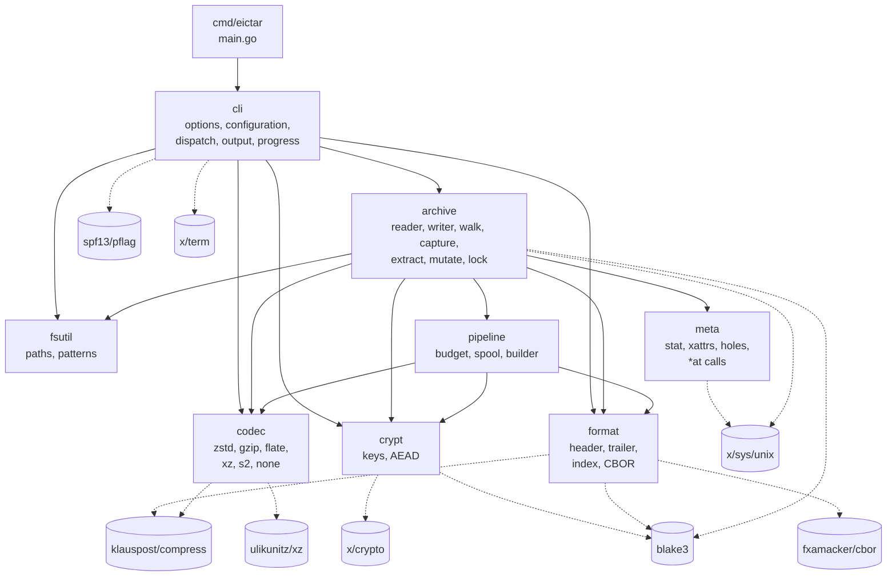
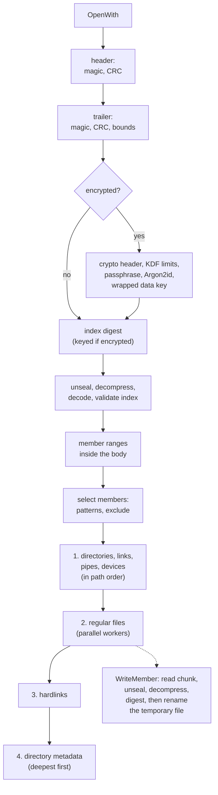
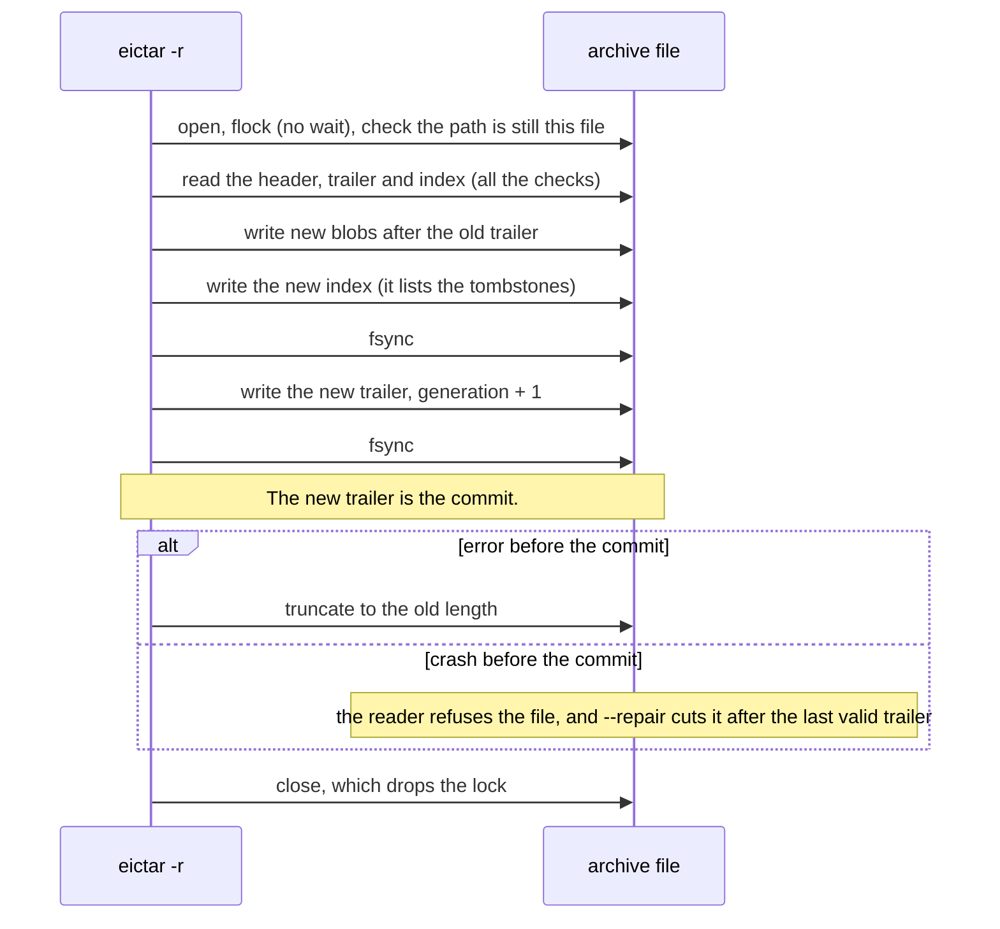

# eictar — Design Document

Status: M1 to M9 are complete. The CI workflow passes on Linux, macOS, FreeBSD, NetBSD and OpenBSD (§15.1).
Date: 2026-09-24
Applies to: v1 (format version 1.0)

This document specifies the on-disk format, the concurrency model, the command
line and the internal package layout of `eictar`. It is the reference for all
implementation work. When the code changes, change this document too.

`problem_statement.md` and this document stay in agreement. The statement says
*what* the program does and *why*. This document says *how*. A change to a
requirement starts in the statement. Then it comes into §1.1 of this document.


## Contents

**[1. Scope](#1-scope)** — decisions, non-goals, open questions and terms.

**Part I — The format on disk.** The bytes that an implementation must obey.
[2. Overview](#2-overview-of-the-format) ·
[3. Fixed structures](#3-fixed-structures) ·
[4. Member payloads](#4-member-payloads-chunks-and-compression) ·
[5. The index](#5-the-index) ·
[6. Cryptography](#6-cryptography)

**Part II — Behavior.** What this implementation does with the format.
[7. Path handling](#7-path-handling) ·
[8. Concurrency](#8-concurrency-model) ·
[9. Mutation](#9-mutation-append-delete-compact-and-repair)

**Part III — Interface.** What a user types.
[10. Command line](#10-command-line-interface) ·
[11. Configuration](#11-configuration-environment-variables-and-the-configuration-file)

**Part IV — Implementation.** How the work is organized and tested.
[12. Package layout](#12-package-layout) ·
[13. Testing](#13-testing-plan) ·
[14. Security](#14-security-considerations) ·
[15. Future work](#15-future-work-format-compatible) ·
[16. Milestones](#16-implementation-milestones) ·
[Appendix A](#appendix-a-why-these-primitives-compared-with-aes)

To learn the format alone, read Part I. To add a feature, read Part II and the
milestone in §16 that owns the feature.


## 1. Scope

`eictar` puts files into one archive file. Unlike `tar`, it compresses each
member separately. When encryption is on, it also encrypts each member
separately. An index at the end of the archive records every member. As a
result, a listing or a selective extraction does not read the member data.

### 1.1 Decisions

| # | Question | Decision |
|---|----------|----------|
| 1 | Container layout | The body is append-only. The index is at the end, followed by a fixed-size trailer. |
| 2 | Encryption | XChaCha20-Poly1305 AEAD, Argon2id key derivation, and one subkey for each member. |
| 3 | Index encryption | Optional, with `--encrypt-index`. **Off by default.** |
| 4 | `ccrypt` fallback | Not necessary. Go's `x/crypto` supplies a modern AEAD and KDF. The requirements no longer include `ccrypt`. |
| 5 | Dependencies | Third-party modules in pure Go are permitted. No CGO and no external binaries. |
| 6 | v1 scope | Create, list, extract, append, update, delete, compact, verify, info and repair. Full metadata. A digest for each member. |
| 7 | Paths in an archive | At most one live member for each path. `-r` on a path that is already in the archive replaces it (§9.2). |
| 8 | macOS ACLs | Not recorded. They need CGO, and the no-CGO rule stays (§15.1). Decided for M8, from open question 4. |
| 9 | Xattrs across platforms | Names are recorded exactly. Each name is applied where the destination takes it, and one notice lists the rest (§7.7). Decided for M8, from open question 5. |
| 10 | Module path | `github.com/philmalin/eictar` (§12). Decided for the first release, from open question 3. |
| 11 | License | GPL-3.0 (`LICENSE`). Under section 7(e), the license gives no right to use the name "eictar" for a modified version (`TRADEMARKS.md`). |

### 1.2 Non-goals for v1

- **Delta storage between versions.** When a file changes, the program stores
  it again as a whole new member. It marks the old member as dead (a
  tombstone). There is no chain of patches.

  A chain makes extraction slower as the history grows, and it breaks when a
  member in the middle is deleted. The cost of this decision: a file that you
  append N times occupies N full copies until `--compact` removes the dead
  copies.
- **Incremental archives, as in `tar --listed-incremental`.** That feature
  keeps a snapshot of a tree so that the next run stores only the changes.
  It is a feature above the format. It can come later with no change to the
  bytes on disk.
- **Content deduplication.** There are two kinds:
  - *Whole-file.* Identical content in unrelated files is stored once.
    Hardlink detection does not find these files. This kind is simple to add
    later (§15).
  - *Chunk-level.* A shared store of chunks, as borg and restic use. This kind
    changes the storage model. Members become lists of shared chunks instead
    of one continuous blob. That needs a chunk index, reference counts and a
    garbage collector. For these reasons it is not in v1.
- **Public-key recipients** (as in `age`). The format keeps space for them
  (§6.2).
- **Pipes.** The program cannot read or write an archive through a pipe. The
  reader starts at the end of the file, so the file must be seekable.
- **Signatures on the whole archive.** In v1, integrity comes from the digest
  of each member and from the AEAD tags.

### 1.3 Open questions

This table lists the decisions that are not made yet. With it, a reader can
tell a decided item from an open one. A decided question leaves the table,
and its number is not used again, because code comments refer to the numbers.
Question 1 (one live member for each path) was decided for M6 (§1.1, row 7).
Questions 4 and 5 were decided for M8 (§1.1, rows 8 and 9). Question 3 was
decided for the first release (§1.1, row 10).

| # | Question | Sections | Needed by |
|---|----------|----------|-----------|
| 2 | **Interleaved `-C`.** `tar` accepts `-C a x -C b y` and changes directory between the path arguments. That needs the argument order, which the option parser does not keep. Until this question is decided, more than one `-C` is a usage error. | §7.1, §10.4 | M7 |

### 1.4 Terms

Each term has one meaning in this document.

| Term | Meaning |
|------|---------|
| member | One entry in the archive: a file, a directory or a link. |
| blob | The bytes of one member's content in the body of the archive. |
| chunk | A fixed-size piece of a member's content. Each chunk is compressed, and sealed, separately. |
| index | The catalog of all members, stored near the end of the archive. |
| trailer | The fixed 96-byte record at the end of the file. It points to the index. |
| generation | A counter that increases each time the program writes a new index. |
| tombstone | A member marked dead. Listings ignore it. Its blob stays until `--compact`. |
| seal | To encrypt and authenticate with the AEAD. "Unseal" is the reverse. |
| digest | A BLAKE3-256 value of some bytes. |
| reader, writer | The parts of the program that open and create archives. |


---

# Part I — The format on disk

Sections 2 to 6 define the bytes. They are the contract for every
implementation. The sections after them describe what this implementation
does.

## 2. Overview of the format

```
offset 0
+--------------------------------------------------+
| File header                    (64 bytes, fixed) |
+--------------------------------------------------+
| Crypto header   (length in the header, if encrypted)|
+--------------------------------------------------+
| Member blob 0                                    |
| Member blob 1                                    |
| ...                                              |  body
| (dead space: old indexes, tombstoned blobs)      |
| Member blob N                                    |
+--------------------------------------------------+
| Index blob            (CBOR -> zstd -> [AEAD])   |
+--------------------------------------------------+
| Trailer                        (96 bytes, fixed) |
+--------------------------------------------------+ EOF
```

The reader opens an archive in this sequence:

1. Read the file header at offset 0 and check it.
2. Read the trailer from the last 96 bytes and check it against the header
   and the file size.
3. If the archive is encrypted, read the crypto header and derive the keys
   (§6.2).
4. Read the index bytes that the trailer points to.
5. Check the index digest that the trailer records (§6.4).
6. If the index is sealed, unseal it. Then decompress it and decode it.
7. Check the byte range of every member against the archive.

Step 7 exists because `Index.Validate` has no file to compare with. A member
range must start at or after the body and end at or before the index. A
member that points into the header, into the index, or past the end of the
file is a corrupt index. Without this step, a bad range can return the wrong
bytes as file content.

Member blobs are **continuous** and **unordered**. The format does not tie
the order of blobs to the order of the paths on the command line. Thus the
writer can accept the member that a worker finishes first (§8).

All integers on disk are little-endian, except where this document says
otherwise. The chunk counters in AEAD nonces are big-endian, as is usual for
AEAD stream constructions.


## 3. Fixed structures

### 3.1 File header (64 bytes, at offset 0, never encrypted)

| Off | Size | Field | Notes |
|-----|------|-------|-------|
| 0 | 8 | `magic` | `45 49 43 54 41 52 1A 0A` = `"EICTAR\x1a\n"` |
| 8 | 2 | `format_major` | 1 |
| 10 | 2 | `format_minor` | 0 |
| 12 | 4 | `header_flags` | bit 0: the archive is encrypted (`format.HeaderFlags`) |
| 16 | 8 | `created_unix_nanos` | the creation time of the archive |
| 24 | 16 | `archive_uuid` | random. The key schedule and the index digest use it. |
| 40 | 4 | `crypto_header_len` | 0 when not encrypted. Maximum 64 KiB (§6.2). |
| 44 | 16 | `reserved` | must be zero |
| 60 | 4 | `crc32c` | of bytes 0..59 |

The `\x1a\n` in the magic stops a terminal early when you `cat` an archive.
It also makes simple text-or-binary detection give the correct result.

### 3.2 Trailer (96 bytes, the last 96 bytes of the file)

| Off | Size | Field | Notes |
|-----|------|-------|-------|
| 0 | 8 | `trailer_magic` | `"EICTRAIL"` |
| 8 | 2 | `format_major` | must be equal to the header |
| 10 | 2 | `format_minor` | must be equal to the header |
| 12 | 4 | `trailer_flags` | bit 0: the index is sealed. Bit 1: the index is compressed. (`format.TrailerFlags`) |
| 16 | 8 | `generation` | increases each time an index is written |
| 24 | 8 | `index_offset` | |
| 32 | 8 | `index_length` | bytes on disk |
| 40 | 8 | `prev_index_offset` | 0 if there is none. For recovery (§9). |
| 48 | 8 | `live_member_count` | tombstones not included |
| 56 | 32 | `index_digest` | BLAKE3-256 of `archive_uuid`, `generation` and the index bytes on disk. Keyed when the archive is encrypted (§6.4). |
| 88 | 4 | `reserved` | zero |
| 92 | 4 | `crc32c` | of bytes 0..91 |

The writer writes the trailer with one `pwrite`. That write is the commit
point for the whole archive (§9).

The two flag words are different Go types, `HeaderFlags` and
`TrailerFlags`. Both use bit 0 of a `uint32`, and both are about encryption.
With plain integers, `trailer.Flags & FlagEncrypted` compiles and gives the
wrong answer without an error. With different types, it does not compile.


## 4. Member payloads: chunks and compression

The writer divides the content of each member into plaintext chunks of
`chunk_size` bytes. The default is 4 MiB, and `--chunk-size` changes it. The
last chunk can be shorter. The writer compresses each chunk separately. If
the archive is encrypted, it then seals each chunk separately (§6.3):

```
plaintext chunk -> compress -> [seal] -> bytes appended to the member's blob
```

The chunks are independent. No compressor state and no cipher state goes
across a chunk boundary. For one large member, this independence gives four
things:

- parallel compression
- parallel decompression
- extraction of a byte range
- authentication that streams, with no need to hold the whole file in memory

A member that is smaller than `chunk_size` is one chunk, and it loses
nothing.

**The body has no framing.** The index records the length on disk of each
chunk (§5.2). Thus the body is only data: no headers, no lengths and no
separators between members. There is a cost, which §9 records. If the index
is lost, a scan cannot recover the archive, because there is nothing to find.

### 4.1 Chunks that compression makes larger

Some chunks compress to their own size or more. The writer stores such a
chunk as plaintext. No flag records this, and no flag is necessary. A
compressed chunk is always shorter than its plaintext. Thus this test has
only one meaning, and the reader uses it:

```
on-disk length == plaintext length   ->   the chunk is stored
```

This rule costs nothing. It also keeps an archive of data that is already
compressed from growing larger than the data.

**When the archive is encrypted, the rule applies to the unsealed bytes.** A
sealed chunk is its payload plus a 16-byte Poly1305 tag. The reader unseals
the chunk first. Then it compares the unsealed length with the plaintext
length. This is the same test as `on-disk length == plaintext length + 16`,
but it has no tag arithmetic to get wrong.


## 5. The index

### 5.1 Schema

The index uses CBOR (`github.com/fxamacker/cbor/v2`). CBOR stores the binary
values of extended attributes without base64 growth. New map keys can extend
the schema, and decoding is fast.

After the writer encodes the index, it compresses the index with zstd. The
`index_compressed` trailer flag records this, so an uncompressed index is
also readable. If `--encrypt-index` is given, the writer then seals the index
as one AEAD message (§6.3).

```
Index := {
  "v":        1,
  "gen":      <uint64>,
  "codecs":   [ CodecSpec, ... ],     # catalog, referenced by array position
  "members":  [ Member, ... ],
}

CodecSpec := { "name": "zstd", "params": { "level": 9, "long": 27 } }

Member := {
  "id":      <uint64>,       # stable, monotonic, never reused
  "gen":     <uint64>,       # generation that added this member
  "path":    "src/main.go",  # slash-separated, relative, cleaned
  "type":    "reg"|"dir"|"symlink"|"hardlink"|"fifo"|"sock"|"chardev"|"blockdev",
  "mode":    <uint32>,       # permission bits + setuid/setgid/sticky, at most 07777
  "uid":     <uint32>, "gid": <uint32>,   # absent with --no-owner
  "uname":   "psm", "gname": "psm",
  "mtime":   <int64 ns>, "atime": <int64 ns>, "ctime": <int64 ns>,
  "size":    <uint64>,       # logical plaintext size
  "link":    "../target",    # symlink target
  "hardlink":<uint64>,       # member id of the first link
  "rdev":    [major, minor],
  "xattrs":  { "user.foo": <bytes>, ... },   # POSIX ACLs are stored here
  "sparse":  [ { "off": <uint64>, "len": <uint64> }, ... ],  # data segments; absent = dense; the blob holds only these
  "digest":  <32 bytes>,     # BLAKE3-256 of the plaintext content
  "codec":   <int>,          # index into "codecs"; -1 = stored
  "chunk":   4194304,        # plaintext bytes per chunk; absent when empty
  "enc":     { "salt": <16 bytes> },          # absent when not encrypted
  "off":     <uint64>,       # blob offset
  "len":     <uint64>,       # blob length on disk
  "chunks":  [ <uint32>, ... ],  # on-disk length of each chunk
  "dead":    true            # present only on tombstones
}
```

The catalog stores each codec's parameters as the values in effect, not as
the text that the user typed. Many members can share one catalog entry.

`uid` and `gid` are optional. With `--no-owner` they are absent, which is
different from uid 0. A stored zero means root to a reader that restores
ownership. The writer records `atime` and `mtime`. It does not record `ctime`,
because no program can restore it.

For a file with holes, `size` is the logical length, and `sparse` lists the
data segments. The blob stores only the bytes of those segments, back to
back. The digest covers those stored bytes. The index covers the map, so the
index digest protects it (§6.4).

### 5.2 The chunk table

`chunk` is a field of the member, not of `enc`. A plaintext archive also has
chunks, and its reader needs the same number to find where each chunk ends.
A member with no content has neither `chunk` nor `chunks`.

The index validator checks that the chunk table agrees with the member:

- The chunk lengths must add up to `len`.
- The payload must fit in `len(chunks)` chunks of `chunk` bytes, and must not
  fit in one chunk less. The payload is `size` for a dense file, and the total
  of the `sparse` segments for a file with holes.
- `chunk` must not be more than **MaxChunkSize (256 MiB)**.

Without the second rule, a reader has no expected size for each chunk. A
decompression bomb needs exactly that gap.

The third rule is a security limit. A reader sizes its decode buffer from
`chunk`, and `chunk` comes from the index, which an attacker can write. In a
test, a 200-byte archive that claimed a 2 GiB chunk size made the reader
allocate 2 GiB. The chunk held five bytes, and extraction does this once for
each worker. The limit is far above the 4 MiB default. The program applies
the same limit to `--chunk-size`, so the error comes when an archive is
created, not when someone reads it.

**A regular file must have a digest.** The wire schema makes the digest
optional, but the validator refuses a `reg` member without one. Only the
digest catches a member whose offset or chunk table points at the wrong
bytes. Without it, a damaged index gives wrong content with no error.

The validator also checks that each field belongs to the member's type:

- Only a symlink has `link`, and a symlink must have it.
- Only a hardlink has `hardlink`, and it must name a `reg` member. That rule
  excludes chains, cycles and links to directories.
- Only a device has `rdev`, and a device must have two values.
- Only a `reg` member has `sparse`. The segments must be in order, must not
  overlap or be empty, and must end inside `size`.
- `mode` must not be more than `07777`. The file type is the `type` field,
  never mode bits.
- An xattr name has 1 to 255 bytes, a value has at most 64 KiB, and a member
  has at most 1024 xattrs. These are the kernel's own limits.

A field on the wrong type is not harmless. A reader that acts on a field,
not on the type, can do what the archive did not mean.

The validator does **not** require canonical member paths. A hostile archive
must still list, so that a user can see what they received. Extraction is
the step that refuses a bad path (§7).

### 5.3 CBOR policy

The library defaults are wrong for this format in three ways.
`src/internal/format/cbor.go` sets the correct behavior:

- **The encoder sorts map keys bytewise.** Go map order changes from run to
  run. Without sorting, one index encodes to different bytes each time, but
  the trailer records a digest of those bytes. Thus the format requires
  determinism.
- **The decoder accepts invalid UTF-8.** A POSIX path is a sequence of bytes,
  not text. The library default refuses a text string that is not valid
  UTF-8. With the default, you can archive a Latin-1 file name but not read it
  back.
- **The array and map limits are explicit.** The default limit is 131072
  array elements, which limits an archive to 131072 members without a
  message. A larger limit alone lets a nine-byte header demand an unbounded
  `make([]Member, n)`. Thus the decoder calculates its limit from the input
  length, because an element cannot exist without bytes. It also applies a
  hard limit, **MaxIndexMembers = 4,194,304** members for each archive. A
  larger archive needs the paged index of §15, not a larger constant.
- **The decoder refuses** indefinite-length items, CBOR tags and duplicate map
  keys. The encoder never writes them.

### 5.4 Size in practice

Before compression, the index uses approximately 200 to 400 bytes for each
member. The chunk table adds 4 bytes for each 4 MiB of content, which is
1 KiB for each GiB. An archive of 1,000,000 files has an index of a few tens
of MiB after compression. That size is acceptable. §15 describes the next
step if an archive becomes too large for this design.


## 6. Cryptography

Encryption is optional. When it is off, this section does not apply, and the
archive is exactly what §2 to §5 describe. When it is on, it adds a crypto
header (§6.2) and a seal on each chunk (§6.3). The chunks themselves do not
change.

### 6.1 Primitives

| Purpose | Choice | Package |
|---------|--------|---------|
| Passphrase KDF | Argon2id | `golang.org/x/crypto/argon2` |
| AEAD | XChaCha20-Poly1305 (24-byte nonce, 16-byte tag) | `golang.org/x/crypto/chacha20poly1305` |
| Subkey derivation | HKDF-SHA-256 | `golang.org/x/crypto/hkdf` |
| Content digest | BLAKE3-256 | `lukechampine.com/blake3` |

XChaCha20 is better than AES-GCM here for three reasons. It is fast without
AES-NI. Its 24-byte nonce removes the risk of nonce collisions. Its pure-Go
implementation runs in constant time on all targets. Appendix A gives the
full comparison.

### 6.2 Crypto header (CBOR, plaintext, present only when encrypted)

The crypto header comes directly after the file header. It is
`crypto_header_len` bytes long. It starts with its own `uint32_le` length of
the CBOR that follows, so a reader can decode it without trust in the outer
field. `crypto_header_len` must not be more than **64 KiB**. A real crypto
header is a few hundred bytes, and a reader allocates the size in the field
before it decodes anything.

```
{
  "v":       1,
  "kdf":     "argon2id",
  "salt":    <16 bytes>,
  "time":    3,             # Argon2id passes
  "memory":  262144,        # KiB (256 MiB default)
  "threads": 4,
  "aead":    "xchacha20poly1305",
  "key":     <72 bytes>,    # the data key, wrapped: see below
  "recipients": [...]       # reserved for public-key mode; absent today
}
```

A reader that finds `recipients` refuses the archive. Such an archive is
addressed to public keys that this build does not know.

**The archive has a random data key, and the passphrase only wraps it.**
Create makes a random 256-bit data key. Every subkey comes from the data key.
The passphrase gives a key-encryption key (KEK) through Argon2id, and the
crypto header stores the data key sealed under the KEK:

```
dataK   = 32 random bytes, made once, at create
KEK     = Argon2id(passphrase, salt, time, memory, threads, 32)
key     = nonce || seal(KEK, nonce, dataK, aad = "eictar/v1/wrap" || archive_uuid)
          nonce = 24 random bytes

indexK   = HKDF(dataK, info = "eictar/v1/index"      || archive_uuid || generation)
authK    = HKDF(dataK, info = "eictar/v1/index-auth" || archive_uuid)
contentK = HKDF(dataK, info = "eictar/v1/content"    || archive_uuid)
memberK  = HKDF(dataK, info = "eictar/v1/member"     || archive_uuid, salt = member.salt)
```

A wrong passphrase gives another KEK, and the seal of `key` fails its tag. The
reader reports that as a wrong passphrase, before it reads anything else.
Thus the tag does what the M4 `check` value did, and `check` is gone. An
attacker can test a guess offline against the tag, as against any file that a
passphrase protects. The Argon2id parameters exist to make each guess
expensive.

The wrapped key is the reason that a passphrase can change (§9.7). A change
seals the same data key under a new KEK. Every subkey stays the same, so no
member is sealed again, and every digest stays valid. Until the format
revision of M9, the passphrase gave the master key directly, and a change was
not possible.

All HKDF instances use SHA-256. The encoding of `generation` is `uint64_le`
in every key and digest. `member.salt` is 16 random bytes, stored in each
member's `enc` field. Each member has its own key, so a nonce must be unique
only inside one member.

**The KDF parameters come from the archive, and the reader treats them as
hostile.** It refuses `time` more than **64** and `memory` more than
**4 GiB**. Then it compares the memory with this machine (§A.3). All of this
occurs *before* the prompt for the passphrase. The cost of Argon2id is linear
in `time`, approximately 1.8 s for each pass at the memory limit. Without the
time limit, a crafted header that asks for 2³²−1 passes stops a listing for
centuries.

**In an encrypted archive, the member digest is keyed.** A plain BLAKE3
digest of the content is readable in an index that is not sealed, which is
the default. Anyone with a copy of a file can then find out if the archive
holds it, whatever its name. Worse, anyone can find the content of a small
file with few possible values, such as a PIN or a short answer. They hash
each candidate, and compare. The content is sealed, but its digest gives it away.

Thus in an encrypted archive, the digest of a member is BLAKE3 keyed with
`contentK`. `--verify`, `-u --update-mode=digest`, compact and recompress
work as before, because every member of one archive has the same key. A
digest cannot be compared across two archives, or with a hash made outside
eictar. The digest of a plaintext archive is the plain BLAKE3, as before.

### 6.3 The AEAD layer

The writer seals each chunk after it compresses the chunk (§4):

```
sealed = seal(memberK, nonce, compressed_chunk, aad)
nonce  = 16 zero bytes || uint64_be(chunk_index)
aad    = uint64_le(member_id) || uint64_be(chunk_index) || final_byte
         final_byte = 0x01 for the last chunk of the member, else 0x00
```

Each member has its own key (§6.2). Thus a nonce must be unique only inside
one member, and a counter gives that result.

The AAD stops chunks from moving between members or inside one member. A
chunk that is unsealed at the wrong index, or in another member, fails its
tag. `final_byte` also catches truncation. If trailing chunks are removed, a
different chunk claims to be the last one, and that claim fails its tag.

The order is compress, then seal, because ciphertext does not compress. §14
describes the small risk that this order causes.

The writer knows which chunk is last only when the next read reaches the end
of the file. Thus the pipeline holds one chunk back until it knows if another
chunk follows (§8).

The index is sealed as one message with `indexK`:

```
nonce  = 24 random bytes
aad    = uint64_le(generation)
sealed = nonce || seal(indexK, nonce, index, aad)
```

**The index nonce is random, and the sealed index stores it.** One
`(archive_uuid, generation)` pair can get two different indexes. These are
three examples:

- You copy an archive, and then you append to the copy and to the original.
- An append writes its index, and then fails before its trailer. The next
  append uses the same generation.
- A compact writes its index, and then its rename fails.

`indexK` comes from the pair. Thus a nonce that also comes from the pair uses
one key and nonce two times. That exposes the XOR of the two indexes, and the
Poly1305 key that authenticates them. Until the M6 review, the nonce came from
the generation. A random 192-bit nonce cannot collide in practice (Appendix A).

Compact must keep the uuid: the member keys come from it, so a new uuid makes
every sealed blob impossible to open.

### 6.4 Authenticating the index

**When a key exists, the index is always authenticated, sealed or not.**
`--encrypt-index` controls *confidentiality* only.

The reason is not obvious. The chunk AAD includes `member_id`, `chunk_index`
and the final flag. It does not include the path, the mode or any other
field of the index.

Suppose the members are sealed but the index is plain,
and the digest has no key. Then an attacker with no passphrase can rename a
member from `notes.txt` to `.ssh/authorized_keys`. The attacker can also add
an execute bit, point a path at a different blob, or tombstone members. Every
chunk still passes its tag, because no tag covers these fields.

The fix does not change the trailer layout. When the archive is encrypted,
`index_digest` is a **keyed** BLAKE3:

```
index_digest = BLAKE3-keyed(authK, archive_uuid || uint64_le(generation) || index_bytes)
authK        = HKDF(dataK, info = "eictar/v1/index-auth" || archive_uuid)
```

When the archive is not encrypted, the digest has the same input but no key.
The uuid and the generation stop an index and a trailer from moving to a
different archive. With a key, they also stop that move between two archives
that use the same passphrase.

A reader without the passphrase cannot check a keyed digest, and it reports
that fact. A reader with the passphrase refuses any changed byte of metadata.

This protection does **not** cover three attacks. They are a rewrite of the
whole file, a rollback to an older genuine archive, and a downgrade to
plaintext. §14.4 describes them.


---

# Part II — Behavior

This part describes what the program does with the format. It covers where
the program can write, how it uses the machine, and how an archive changes.

## 7. Path handling

This section says what a member path can contain and where extraction can
write. It also says why the program checks paths two times. §10.4 lists the options
that name a destination. This section gives their meaning.

### 7.1 Where extraction writes

Two options name a place. You can give only one of them:

- **`-d DIR` / `--destination DIR`** extracts into DIR. It applies to
  extraction only. If DIR does not exist, the program creates it, with its
  parent directories. This is the `unzip -d` spelling.
- **`-C DIR` / `--directory DIR`** changes to DIR first, as in `tar`. DIR must
  exist already. During create, it also changes how the program finds the
  paths that follow.

If you give both, the result is a usage error. Both options name the place of
the work, and a wrong guess puts a tree in a place that the user did not
choose. `-d` together with `-O`/`--to-stdout` is also a usage error, because
content on standard output has no destination directory.

In `tar`, `-d` means `--compare`. In `zip`, it deletes entries. Neither
meaning causes a problem here. This tool has no compare operation, and `-d`
does not select an operation. Thus `eictar -d out -f a.ect` fails the
one-operation rule, and it deletes nothing.

### 7.2 The archive never contains itself

The writer creates the archive file before the walk starts. A walk through
the directory that holds the archive finds the archive as an ordinary file.
A copy of it reads bytes that the writer is still writing. Thus the writer
skips it and prints one notice. The comparison uses the inode, not
the name. A symlink or a different spelling of the same path cannot get past
it.

### 7.3 How paths are stored

The writer stores member paths as relative, slash-separated and clean paths,
with **no leading `/` and no leading `..` component**. `/etc/passwd` becomes
`etc/passwd`. `../sibling` becomes `sibling`. When a run removes part of a
path, it prints one warning, not one warning for each file:

```
eictar: removing leading '/' from member names
```

`tar`, `zip` and `pax` use the same rule. An archive holds a portable tree,
not a set of locations in a filesystem. An absolute `/etc/passwd` extracts
over the file of the system, not under the destination.

**`eictar` has no `-P`/`--absolute-names` to turn this rule off.** An archive
that writes to absolute paths is a hazard. Its only real use is to restore a
system over itself. `-d /` does that job, and it states the intention at the
time of extraction, not inside the archive.

A `..` inside a path is not an escape. The writer resolves it, so `a/b/../c`
becomes `a/c`. A path that resolves to nothing (`/`, `..`, `.`) names the root
of the archived tree. The writer stores it as `.`.

### 7.4 Writing a member

The reader extracts each member to a temporary name in the same directory.
When the digest is correct, it renames the file into place. With a direct
write to the destination, a member that fails part way through destroys the
old file before the failure is known. People usually read an archive
when the original is gone. The rename is atomic. Another reader sees the old
file or the complete new file, never half of a file.

The reader sets the mode and the times on the temporary file *before* the
rename. Thus a file is never readable, even briefly, by a user that its final
mode excludes. Directories start as `0700` and get their real mode in a final
pass, for the same reason. A directory that ends as `0700` must not be open
to other users while the reader writes the files in it.

An interrupted extraction can leave a `.eictar-part-*` file. This is
intentional. A leftover file with a clear name is better than a truncated
file with the real name.

### 7.5 How paths are checked on extraction

A check on the way into the archive is not sufficient, because another
program can write an archive. Thus the reader checks every member again on
the way out. The path must be relative, canonical and free of `..`. It must
also resolve to a place under the destination. The reader refuses any other
path, and a refusal is an error, not a skip.

### 7.6 Symbolic links

Three rules apply to links:

- **The writer stores link targets exactly as they are.** This includes
  absolute targets and targets that go outside the tree (`../../outside`). A
  link target is content, not a path inside the archive. To restore
  `/usr/bin/vi -> /etc/alternatives/vi`, the reader must write that exact
  target. The protection is that extraction never *follows* a link. A link
  does nothing until something follows it.
- **The reader restores the times of a link with `utimensat` and
  `AT_SYMLINK_NOFOLLOW`.** `Chtimes` and `os.Root.Chtimes` follow the link. On
  a link, they change the time of the file that the link points to, without
  an error. The no-follow call works on the descriptor of the parent
  directory, which comes from `os.Root`, with a single name component.
- **Extraction never goes through a linked directory.** A crafted archive can
  create `evil -> /etc` and then write `evil/passwd`. That write must not
  reach `/etc`. The lexical check in `fsutil.SafeJoin` cannot catch this
  alone.

  Thus **every filesystem operation during extraction goes through
  `os.Root`** (Go 1.24 and later). `os.Root` holds a descriptor on the
  destination. It refuses every path that leaves the destination, through
  links too. This standard-library feature gives a stronger guarantee than a
  check on each path component.

`os.Root` has two properties to know about. It *follows* a relative link that
stays inside the destination. It only guarantees that nothing escapes. Also,
`Root.Chmod`, `Root.Chown` and `Root.Chtimes` have a documented race
(TOCTOU). If a file becomes a link during the operation, the operation can
apply to the link. The risk is small when extraction goes into a new
directory.


### 7.7 Metadata on extraction

The defaults are safe. Extraction restores what a user can restore, and
nothing that needs privilege or gives it:

| Metadata | Default | Option |
|----------|---------|--------|
| permission bits | restored | |
| setuid, setgid, sticky | **not** restored | `-p` restores them |
| atime, mtime | restored, links included | |
| owner | not changed | `--preserve-owner`, as root |
| `user.*` xattrs, and names with no namespace (macOS) | restored | `--no-xattrs` omits them |
| POSIX ACLs | restored | `--no-acls` omits them |
| `security.*`, `trusted.*` and other `system.*` xattrs | restored only as root | `--no-xattrs` omits them |
| FIFOs | created, except on macOS (§15.1) | |
| device nodes | skipped with a notice | `--preserve-devices`, as root |
| sockets | skipped with a notice | |
| holes | kept | |

**The owner goes on before the mode.** `chown` clears the setuid bit, so a
mode set first loses it. On a regular file, the owner, the xattrs and the mode
go on the temporary file before the rename (§7.4). Thus the file never
exists under its real name with the wrong metadata.

**The owner is found by name first.** An archive records the owner by number
and by name. The same uid on two machines is rarely the same person, but the
same user name usually is. If the name does not exist on this machine, the
reader uses the recorded number. `tar` uses the same rule.

**Privileged xattrs need root.** `security.*` often holds an SELinux label
that belongs to one machine. `trusted.*` needs `CAP_SYS_ADMIN`. Other
`system.*` names belong to one filesystem type, and on FreeBSD and NetBSD the
system namespace needs root.

**Xattr names are recorded exactly, and applied where they fit.** Each
platform names xattrs differently. Linux uses namespaces (`user.comment`).
macOS has none (`com.apple.quarantine`). FreeBSD and NetBSD have two, which
eictar writes as `user.` and `system.`. An archive keeps each name as the
source platform gave it, and does not translate it.

On extraction, the reader
sets each name that the options allow. A name that the destination does not
take is counted, and one notice at the end of the run lists those names.
Examples are a macOS name on Linux, a Linux `security.*` name on FreeBSD, and
any name on a filesystem without xattrs. The member does not fail.

On create, an xattr larger than the format allows (64 KiB) is left out with a
notice, and the file is archived. Linux never makes one that large, but a
macOS resource fork can be.

**A hardlink links to its target.** If the target was not extracted in this
run, for example because a pattern excluded it, the first link gets the
content of the target. Thus a request for one name of a file always gives the
file. The other links to the same target then link to that first copy, so
that the names stay one file.

**Pipes and devices are created with `mkfifoat` and `mknodat`.** Each call
uses a descriptor of the parent directory from `os.Root`, and a single name
component. A link in the path cannot redirect them.

**Holes stay holes.** The reader writes each data segment at its offset, and
then extends the file to its logical size with `ftruncate`. That creates the
holes without writes. With `-O`, the reader writes the holes as zeroes,
because a stream has no holes.

**A socket is skipped with a notice, on create and on extract.** It has no
content, and its meaning is the process that listens on it. `tar` skips
sockets too. This is the one type that is skipped, not refused.


## 8. Concurrency model

```
                                  +-> worker 1 -+
 walk and read ---- chunks ------>+-> worker 2 -+--> member spools --> emitter --> archive
 (one goroutine)                  +-> worker N -+   (chunk order)    (one goroutine)
       |                                                                 ^
       +------------ directories and links (no payload) -----------------+
```

- **Walk and read.** One goroutine walks the input paths in name order. It
  sends directories, links, pipes and devices directly to the emitter,
  because they have no payload.

  It finds hardlinks by `(dev, ino)`: the first name of an inode stores the
  content, and later names point to it. It finds holes with `SEEK_DATA` and
  `SEEK_HOLE`, and reads only the data segments.

  It reads each regular file in order, one chunk at a time, and sends the
  chunks to the workers. It holds each chunk back until it knows if
  another chunk follows, so that the last chunk can be sealed as final
  (§6.3). Reading is sequential, whatever the number of workers.
- **Workers.** `-j` sets the number of workers. The default is `GOMAXPROCS`,
  and the limit is 1024. Each worker compresses a chunk, stores it as
  plaintext if it grew (§4.1), and seals it if the archive is encrypted. Then
  it adds the chunk to the spool of its member, in chunk order.
- **Spools.** A spool holds the encoded blob of one member until the emitter
  is ready. It keeps the bytes in memory up to `--spill-threshold` (default
  32 MiB). After that, or when memory is short, it moves the bytes to an
  unlinked temporary file in the directory of the archive.
- **Emitter.** One goroutine owns the file offset. It takes each complete
  member in the order that members finish. It writes the blob, records the
  real offset in the index, and releases the spool. Member order in the
  archive has no meaning, so the emitter never waits for a specific member.
  One large file does not block the others.

The writer gives member ids in **walk order**, not in the order that members
finish. It sorts the index by id before it writes the index. Thus the byte
layout changes with the number of workers, but the index, and every listing,
does not change.

### 8.1 Memory budget

A global memory budget controls how much data is in flight. `--memory-limit`
sets it. The default is the smaller of 25% of RAM and `j × 4 × chunk_size`.
On Linux, the program reads RAM from `/proc/meminfo`. The reader goroutine
reserves one chunk of budget before each read. The worker releases the
reservation when it has handed the chunk to the spool.

Four rules prevent deadlock. The first version of M3 deadlocked, and so did
M7 on a small machine. These rules are the fix:

- **Nothing waits for budget while it holds budget.** A worker releases its
  chunk reservation *before* it adds the chunk to the spool, because the
  spool can need memory of its own.
- **A spool never waits.** A spool releases its bytes only when its member is
  complete. A spool that waits for budget can wait for itself. Thus it uses a
  non-blocking `TryAcquire`. If that fails, the spool moves to disk, which is
  also the correct response to low memory.
- **The reader does not wait for its own member.** While the reader reads a
  member, the finished chunks of that member are in its spool, and they hold
  budget. The member is complete only when the reader goes on. Thus, if the
  budget is not free at once, the reader first moves that spool to disk, and
  then it waits. Everything else that holds budget is released without the
  reader.

  Until M8, this rule was missing. With 2 workers and 512-byte chunks, a
  create stopped for ever. With the defaults, a file of 24 to 32 MiB on a
  machine with two CPUs was able to do the same. A run of the tests as on a
  CI runner with two CPUs found it.
- **The budget is at least two chunks.** The reader holds one chunk while it
  waits for the next. The builder raises a smaller budget to two chunks.

A request that is larger than the whole budget goes through immediately.
Waiting cannot help it. Also, the requester can be the only holder that can
release budget. A chunk size above the memory limit gives a slow archive, not
a stopped one.

### 8.2 The shared encoder

**All workers share one encoder, and the encoder must know how many workers
there are.** The setting looks like a codec thread count, but it is not.
The zstd encoder of klauspost keeps a pool of states for its callers. The
size of the pool comes from `WithEncoderConcurrency`. `EncodeAll` holds one
state for the whole call.

An encoder with a pool of 1, shared by many
workers, is correct and free of races, but it is fully serial. The workers
run, but only one of them compresses at a time.

The first version of M3 had this fault, and a measurement showed it. With
207 MB at zstd level 12, `-j 1` took 3.15 s and `-j 8` took 3.28 s. User time
was equal to wall time.

When the pool size is equal to the worker count, the
same work takes 0.57 s at `-j 8`. User time stays at approximately 3.3 s.
Thus `codec.NewEncoder` takes the concurrency as an argument. A codec
conformance test fails if a shared encoder is serial.

A `--codec-workers` option for real codec threads (for one very large file)
is not in v1. For this reason it is not in §10.4.

### 8.3 Parallel extraction

Extraction has four phases:

1. **Directories, links, pipes and devices**, in path order, on one goroutine. They have no
   payload, and the files need them to exist first. If workers create them
   in parallel, the result depends on a race. A member can go into a real
   directory, or a link with the same name can refuse it. The outcome depends
   on which worker wins.
2. **Files**, across N workers. Each worker reads its own byte ranges with
   `pread`, through the shared `os.Root`. Both are safe for concurrent use.
   There is no shared file offset and no lock.
3. **Hardlinks**, after their targets exist.
4. **Directory metadata** (xattrs, owner, mode, times), deepest first, in a
   final pass. Writing a child changes the mtime of its parent. Also, a
   default ACL set early passes to the files that extraction writes into the
   directory.

Each worker decodes into a buffer of its member's chunk size. The chunk size
comes from the index, so the reader limits the number of workers against the
memory budget: `workers × 2 × chunk_size` must fit. Without --memory-limit,
the budget is 25% of RAM, or 512 MiB when RAM is not known.

### 8.4 Measured performance

`make compare` runs `bench/compare.sh`, which compares eictar with `tar`
piped into a compressor. These results are for source code: the unpacked
modules of the build, 77 MB in 1754 files, on 32 CPUs.

| Method | Size | Create | Extract |
|--------|-----:|-------:|--------:|
| `tar \| zstd -3 -T0` | 56.1% | 0.20 s | 0.06 s |
| eictar `zstd:level=3` | 60.6% | 0.17 s | 0.09 s |
| `tar \| zstd -19 -T0` | 51.1% | 8.53 s | 0.06 s |
| eictar `zstd:level=19` | 57.1% | 0.64 s | 0.09 s |
| `tar \| xz -6 -T0` | 50.8% | 7.81 s | 1.04 s |
| eictar `xz:preset=6` | 57.2% | 2.08 s | 0.53 s |
| `tar \| gzip -6` | 61.9% | 1.39 s | 0.26 s |
| eictar `gzip:level=6` | 63.9% | 0.13 s | 0.11 s |
| eictar `s2` | 65.8% | 0.17 s | 0.09 s |
| eictar `zstd:level=3`, encrypted | 60.7% | 0.32 s | 0.29 s |

**An eictar archive is 4% to 13% larger.** It compresses each file alone,
so it cannot use a pattern that repeats across files. A `tar` stream can.
This is the cost of the design (§1.1).

**Strong compression is much faster:**
13 times for zstd level 19, and 11 times for gzip. The chunks of all files
compress in parallel, but one compression stream cannot use more than a few
CPUs. The time of an encrypted archive includes the Argon2id derivation at
the default 256 MiB.

`make bench` runs Go benchmarks of eictar alone, on a mixed tree of 64 MiB:
2000 small files, large text files, and random data.

**The benchmarks found a fault.** The pipeline made a new buffer of the chunk
size (4 MiB) to read each file, also a file of 8 KiB. For 2000 small files,
the program cleared 8 GB of memory, and 20% of its CPU time went to that. Now
one read buffer stays from file to file, and a short chunk is copied out at
its own size. Create became 2.8 times faster with zstd, and 7 times faster
with no compression.


## 9. Mutation: append, update, delete, compact and repair

Each mutation writes a new index generation. The body is append-only. The
writer never writes over bytes that a valid trailer describes.

A mutation of an encrypted archive needs the passphrase. New members are
sealed, and every new index gets a keyed digest (§6.4), even when the
mutation adds no content.

**Create writes a new file, not over the old one.** The writer makes a
temporary file beside the archive path, and `Close` renames it into place
after the trailer is synced. Until the rename, a file that is already at the
path stays as it was. Before the M6 review, create truncated that file at
the start and removed it after an error, so one mistyped source path
destroyed a backup.

The new file gets the permissions of the file that it replaces. If the path is a symbolic link, the file that the link points to is
replaced, and the link stays. The walk skips both the temporary file and the
old archive, so neither goes into the new archive.

### 9.1 The write sequence

Append, update and delete all use this sequence:

1. Open the archive for reading and writing. Check it, and load the index.
2. Write the new member blobs **after the old trailer**, at the old end of the
   file. The old index and the old trailer stay in place as dead space.
3. `fsync` the data.
4. Write the new index. Then `fsync`.
5. Write the 96-byte trailer with `generation + 1` and
   `prev_index_offset = <old index_offset>`. Then `fsync`.

Step 5 is the commit. Until then, the old trailer still describes the old
generation exactly, at its old place.

The old trailer must stay intact. A new blob written over it destroys the only
trailer in the file. Until the M6 review, this section put the new blobs
directly after the old index, on top of the old trailer. After a crash, that
left nothing to recover. Each generation now costs 96 bytes of dead space.

If a mutation fails before step 5 with an error (not a crash), the writer
truncates the file back to its old length. The archive is then exactly as it
was. A run that changes nothing, because every path was skipped or up to
date, also leaves the file as it was. It adds no generation.

The append writer opens the file for reading and writing, and then goes to
the old end of the file before it writes. Without that step, the first write
goes on top of the header.

### 9.2 One live member for each path

An archive has at most one live member for each path.

- **Append** (`-r`) adds the named paths. If a path is already live in the
  archive, `--on-conflict` decides:
  - `replace` (the default): tombstone the old member and add the new one, in
    the same generation. This agrees with the result that a `tar` user sees,
    where the last copy wins.
  - `skip`: keep the old member and add nothing for that path.
  - `error`: stop, and leave the archive unchanged (exit 2).
- **Update** (`-u`) replaces a live member only when the test of §10.5 finds
  it out of date. It adds paths that are not in the archive.
- **Delete** (`--delete`) tombstones the live members that match the
  patterns. A directory pattern also matches the members under it. If a
  pattern matches nothing, the program stops and changes nothing.

A path that one run names two times, for example `a` and a directory that
contains `a`, gets one member. The program skips the second one with a
notice. This rule applies to create also.

The old member becomes a tombstone only after the new member is recorded.
Under `--keep-going`, a path that cannot be read keeps its old member. If the
tombstone came first, the archive lost both copies.

A tombstone keeps its record in the index, with `"dead": true`. Its blob
stays until `--compact`.

**A hardlink can point to a tombstone.** Suppose that `a` and `b` are two names
of one file, and a new `a` replaces the old one. `b` still points to the old
member, whose content is in the old blob. The old member cannot give its
content to `b`, because the chunk AAD binds the member id (§6.3). Thus a
tombstone that a live hardlink points to stays readable. Extraction finds it,
and compact keeps it.

### 9.3 Compact

`--compact` writes a new archive to a temporary file beside the original. It
copies the live blobs, and the blobs of the tombstones that live hardlinks
point to, byte for byte. It does not decompress or unseal a blob.

The new archive keeps the uuid, the crypto header and the encryption settings
of the original. It uses the next generation. Then the program renames the new
file over the original with `rename(2)`, and syncs the directory. A crash
before the rename leaves the original unchanged.

The new file gets the mode of the original. It also gets the owner and the
group, when the process has permission to set them. Otherwise the program
prints a warning. If `-f` names a symbolic link, compact replaces the file
that the link points to, and the link stays.

If there is no dead space and no tombstone to remove, compact changes nothing
and says so. For an encrypted archive, compact needs the passphrase, for the
keyed index digest.

**`--recompress SPEC` encodes every member again.** It decodes each kept
member, and sends it through the same pipeline that create uses. The pipeline
uses the codec of SPEC, and the `--chunk-size`, `-j` and memory options. A member keeps
its id, its digest, its metadata and its tombstone mark. The catalog gets the
one new entry.

A sealed member gets a new member salt, and thus a new key. Its new chunks
are new ciphertext at the old chunk indexes. Under the old key, each chunk
nonce is then used two times, which §6.3 forbids. The digest of the old
content is checked as it is decoded. The pipeline calculates the new digest
from the same bytes, so a member that changes on the way stops the run.

### 9.4 Verify and info

`--verify` checks an archive without extraction. By default it decodes every
live member, and checks every digest and every AEAD tag. That catches damage
in the blobs, which is the likely fault. `--quick` checks only the structure:
the header, the trailer, the index and the member ranges. It reads no member
data. A damaged member gives exit 3, and the output names each one.

`--verify` also decodes each tombstone that a selected hardlink points to,
because extraction reads it. Patterns select members, as for `-t`, and each
pattern must match at least one member. On
success, `--verify` prints one summary line, unless `-q` is given. `-v` also
prints each member that passed.

`--info` shows the header, the crypto parameters, the generation, the counts
of live and dead members, the codecs in use, and the dead space. The dead
space is the number of bytes that `--compact` removes.

### 9.5 Repair

After a crash during a mutation, the file ends with new data, not with a
trailer. The reader refuses the file with exit 3, and the message names
`--repair`. The reader does not open an older generation automatically. A
backup tool must not give older data without a clear signal.

`--repair` searches back from the end of the file for the last valid trailer.
It reads the file in windows of 1 MiB and looks for the trailer magic. For
each candidate, it does every check that a reader does, as if the file ended
after that trailer. These checks are the magic, the CRC, the bounds, the
index digest, the index decode and the member ranges. For an encrypted
archive, the digest check needs the passphrase.

`--repair` asks for the passphrase one time, and derives the keys one time.
An archive of archives, stored with no compression, contains a real trailer
inside each member. One Argon2id run for each candidate is too slow.

Then `--repair` truncates the file after the first valid trailer from the
end. That restores the last complete generation exactly, and it reports how
many bytes it removed. On an archive that opens correctly, `--repair` changes
nothing. A wrong passphrase stops the repair before the scan starts, because
that archive is not damaged.

The body has no framing, so a scan cannot recover an archive whose every
trailer is damaged. This is the cost of the unframed body (§4).

### 9.6 Concurrent writers

The problem statement requires that two runs that change one archive at the
same time never damage it. Without protection, two appends both write after
the same old trailer, and each writes over the blobs of the other.
Overlapping cron jobs cause this.

Each writer takes an advisory lock on the archive file:

- Append, update, delete, compact and repair take an exclusive lock
  (`flock(LOCK_EX | LOCK_NB)`) before they read the trailer. They keep it
  until the new trailer is synced, or until the rename for compact.
- Create locks the file that it replaces, if there is one, and keeps the lock
  until its rename.
- If another process holds the lock, the program stops with exit 4 and the
  message "another eictar is changing this archive". It does not wait. A
  backup job that waits can hang with no message.
- List, extract, `--verify` and `--info` take no lock. The trailer is the
  commit point, so a reader sees one complete generation.

**A lock is on one inode, and compact and create rename a new inode over the
path.** Suppose that a process opens the path immediately before such a
rename. It then locks the old file, which the rename has unlinked, and its
writes are lost. Thus, after it gets the lock, a writer makes sure that the
path still names the file that it locked. If not, it stops with the same
error.

The M6 plan put a lock on the new file of compact instead. That does not stop
the lost write.

The lock is advisory: a program that does not ask for it can still write.
The kernel removes the lock when the process ends, so a crash leaves no stale
lock. Linux, macOS and the BSDs use `flock`, and Windows uses `LockFileEx`,
in a separate file for that platform. Plan 9, WASI and AIX have no `flock`, so
there the program does not find a second writer. A lock on NFS is not
reliable, and the man page says so.


### 9.7 Change of passphrase

`--change-passphrase` seals the archive's data key under a new passphrase
(§6.2). It needs the old passphrase, and it asks for the new one two times,
as create does. `--new-passphrase-file` and `--new-passphrase-env` give the
new one without a prompt. The `--kdf-*` options set new Argon2id parameters.
Without them, the archive keeps the parameters that it has. Thus a change of
passphrase is also the way to make an old archive's key derivation stronger.

**The change writes the file again, as compact does (§9.3).** It writes a new
file beside the archive, with the new crypto header, and renames it over the
archive. A crash before the rename leaves the old archive, which the old
passphrase opens. A change in place is not possible, because the crypto
header changes size with the new parameters. It is not safe either: a crash
in the middle of the only copy of the wrapped key loses the archive.

The data key does not change, so the blobs are copied byte for byte, with no
second encryption. Like compact, the change drops the dead space. The old
wrapped key is not in the new file.

On most filesystems, the blocks of the old file are free space until
something writes over them. Thus a person can still read what the archive
held then with a copy of the old file. The old passphrase and access to the
disk are enough too. A change of passphrase
cannot take back what someone already has. Only a new archive, with a new
data key, can protect new content from a leaked key.

---

# Part III — Interface

## 10. Command line interface

The command line uses the classic UNIX style. An option selects the
operation, not a subcommand, so a command line has the same shape as a `tar`
command line. Every short option has a GNU-style long form, and short options
can be combined.

```
eictar -c -f ARCHIVE [options] PATH...        # create
eictar -cf ARCHIVE [options] PATH...          # same, combined
eictar -tvf ARCHIVE [PATTERN...]              # list, verbose
eictar -xf ARCHIVE [-d DIR] [PATTERN...]      # extract
eictar -rf ARCHIVE [options] PATH...          # append
eictar --delete -f ARCHIVE PATTERN...
```

### 10.1 Operation selection

A command line must have exactly one operation option. Two operations are a
usage error. No operation is also a usage error, with one exception. If you
run `eictar` with no arguments at all, it prints the full help on stdout and
exits with 0. A person who types the name of an unknown program wants to know
what it does, and that is not a mistake. When there is at least one argument,
a missing or doubled operation gets a short error on stderr and exit 2.

| Short | Long | Operation | Positional arguments | Built |
|-------|------|-----------|----------------------|-------|
| `-c` | `--create` | Create a new archive. Replace an existing one when the new one is complete (§9). | paths to archive | M2 |
| `-r` | `--append` | Append to an existing archive. A path that is already there is replaced (§9.2). | paths to archive | M6 |
| `-t` | `--list` | List the members from the index | patterns (default: all) | M2 |
| `-x` | `--extract` | Extract members | patterns (default: all) | M2 |
| `-u` | `--update` | Append only the paths whose copy in the archive is out of date (§10.5) | paths | M6 |
| | `--delete` | Tombstone the matching members | patterns | M6 |
| | `--compact` | Write the archive again without the tombstoned blobs | none | M6 |
| | `--verify` | Check integrity without extraction | patterns (default: all) | M6 |
| | `--repair` | Restore the last complete generation after an interrupted write (§9.5) | none | M6 |
| | `--info` | Show the archive header, the codecs in use, counts and dead space | none | M6 |
| | `--change-passphrase` | Seal the data key under a new passphrase, and write the archive again without its dead space (§9.7) | none | M9 |
| | `--list-codecs` | Show each codec with its parameters, defaults and ranges | none | M2 |

All operations are built. An option that is not built yet exits with 70 and
names its milestone (§10.6).

The operations without a short letter did not exist in `tar`. Thus there is
no habit to keep, and no letter to spend. `--delete` has the GNU tar spelling
on purpose.

There is no `--replace` operation. `-r` replaces a path that is already in the
archive (§9.2).

`-f` is necessary for every operation except `--list-codecs`. There is no
default archive and no tape device. The index is at the end of the file, so
the file must be seekable, and a pipe is not possible (§1.2).

### 10.2 Compression selection

```
-Z, --compress SPEC    # SPEC := "none" | "NAME[:k=v[,k=v]...]"
-z, --gzip             # the same as --compress gzip
-J, --xz               # the same as --compress xz
    --zstd             # the same as --compress zstd (the default)
```

`-z` and `-J` have their `tar` meanings. `-Z` does not. In `tar`, `-Z` selects
`compress(1)`, which is obsolete. This tool does not support it, so the
letter selects the general form here. `-j` is **not** bzip2 (see §10.4).

Examples:

```
--compress zstd:level=19,long=27
--compress xz:preset=6
--compress gzip:level=9
--compress none
```

A registry checks the name and the keys of each codec. A bad spec is a usage
error (exit 2), and the program reports it before it touches the archive
file. The index catalog stores the values in effect for each codec. `eictar
--list-codecs` shows every codec with its keys, defaults and ranges.

| Codec | Library | Notes | Built |
|-------|---------|-------|-------|
| `zstd` | `klauspost/compress/zstd` | default. `level` 1..22, `long` 10..30 | M2 |
| `none` | — | stored | M2 |
| `gzip`, `flate` | `klauspost/compress` | `level` 1..9, default 6. `gzip` is `flate` in a gzip member for each chunk. | M7 |
| `xz` | `ulikunitz/xz` | `preset` 0..9, default 6. Raw LZMA2, slower than the C implementation. | M7 |
| `s2` | `klauspost/compress/s2` | very fast. `mode=fast`, `better` (default) or `best` | M7 |

**Every codec must compress and decompress.** The M6 design also listed a
bzip2 codec for decompression only. No writer of eictar makes bzip2
members, so the codec was dropped.

**The `xz` codec stores raw LZMA2, without the `.xz` container.** The
container declares the dictionary size, and the library honors it. Thus a
crafted chunk can make the reader allocate 4 GiB. A raw LZMA2 stream has no
such field. The reader uses the chunk size as the dictionary, and that is
always enough, because chunks are independent.

The CRC-64 of the container repeats what the BLAKE3 digest checks. `doc/format.md` gives the exact form.

**Every `xz` preset uses the hash-chain match finder.** The C `xz` uses a
binary tree from preset 4. The binary tree of `ulikunitz/xz` takes quadratic
time on repetitive input. On 128 KiB of one repeated byte, it takes 10 s. On
a 4 MiB chunk of zeroes, it takes hours. Thus a preset changes only the dictionary
size, which is capped at the chunk size.

**`s2` and `flate` have no check of their own.** A changed byte can decode to
wrong content of the right length. The BLAKE3 digest of the member finds it
(§5). The other codecs also find it themselves.


The codec is a field of each member. Thus an archive can contain different
codecs from different append operations. All members of one operation use
the selected codec, as constraint 2 of the problem statement requires.

### 10.3 Encryption

```
-e, --encrypt                # turn encryption on; prompts for a passphrase
    --passphrase-file FILE   # the first line of FILE
    --passphrase-env VAR     # the value of VAR (visible in /proc; not recommended)
    --encrypt-index          # also seal the index (default: off)
    --kdf-time N             # Argon2id passes, 1..64 (default 3)
    --kdf-memory KiB         # Argon2id memory in KiB, up to 4194304 (default 262144)
    --kdf-threads N          # Argon2id threads (default 4)
    --new-passphrase-file FILE   # with --change-passphrase: the new passphrase
    --new-passphrase-env VAR     # with --change-passphrase: the new passphrase
```

You select encryption when you create an archive, and it applies to the whole
archive. An append to an encrypted archive needs the same passphrase. This
agrees with the problem statement: one secret key for all members.

`--encrypt` and `--encrypt-index` apply to create only. The `--kdf-*`
options apply to create and to `--change-passphrase`. On any other operation
they are a usage error, because the header of an existing archive fixes its
encryption. The `--kdf-*` limits are the same
limits that a reader applies (§6.2).

The program reads the passphrase from the terminal with echo off. **On
create, and for the new passphrase of a change, it asks two times**, because a mistyped passphrase cannot be
recovered. No part of the program can find out later what you meant. The
program asks only when an archive needs a passphrase. Thus a plaintext
archive never prompts, and a usage error never asks for a secret. The prompt
goes to stderr, so it cannot go into a redirected listing or into extracted
content.

`--passphrase-env` prints a warning. Any process that can read this
process's environment can see the value.

**A passphrase source means "this archive is encrypted".** If you give
`--passphrase-file` or `--passphrase-env` and the archive is plaintext, the
program refuses the archive with exit 3. This is how it catches an archive
whose encryption was removed (§14).

### 10.4 General options

| Short | Long | Meaning | Built |
|-------|------|---------|-------|
| `-f` | `--file ARCHIVE` | the archive to use (necessary). A name with no extension gets `.ect` (§10.12). | M1 |
| `-d` | `--destination DIR` | extract into DIR, and create DIR if it does not exist. Extraction only. | M2 |
| `-C` | `--directory DIR` | change to DIR first. DIR must exist. More than one `-C` is refused (open question 2, §1.3). | M2 |
| `-v` | `--verbose` | list members during the operation. Repeat for more detail. With `-t`, `-v` gives the long listing and `-vv` adds more (§10.9). | M2 |
| `-q` | `--quiet` | errors only | M2 |
| | `--progress` | a progress meter on stderr when stderr is a terminal (§10.10) | M7 |
| `-j` | `--workers N` | number of workers, 1..1024. Default `GOMAXPROCS`. | M3 |
| | `--chunk-size SIZE` | plaintext chunk size, 512 B..256 MiB. Default 4 MiB. | M2 |
| | `--memory-limit SIZE` | the memory budget. Default in §8.1. | M3 |
| | `--spill-threshold SIZE` | the size at which a member's spool moves to disk. Default 32 MiB. | M3 |
| `-T` | `--files-from FILE` | read the paths from FILE, or from stdin if FILE is `-` | M2 |
| | `--exclude GLOB` | can be repeated. Applies to create, append, update, list and extract. An excluded directory is not entered. | M5 |
| `-X` | `--exclude-from FILE` | one glob on each line. Blank lines are ignored. There is no comment syntax, because a file name can start with `#`. | M5 |
| `-R` | `--regex RE` | can be repeated. Keep only the paths that match a regular expression (§10.11). Create, append, update, list, extract, verify and delete. | after M9 |
| | `--exclude-regex RE` | can be repeated. Leave out the paths that match. An excluded directory is not entered, and on a read it takes its contents (§10.11). | after M9 |
| `-h` | `--dereference` | follow links and store what they point to | M2 |
| | `--one-file-system` | do not enter other filesystems. A mount point is recorded, empty. Create, append and update. | M5 |
| `-p` | `--preserve-permissions` | also restore setuid, setgid and sticky (§7.7). Extract only. | M5 |
| | `--preserve-owner` | restore the owner (§7.7). Extract only. Without root, exit 2. | M5 |
| | `--preserve-devices` | create device nodes. Extract only. Without root, exit 2. | M5 |
| | `--no-xattrs`, `--no-acls`, `--no-owner` | on create, append and update, do not record that metadata. On extract, do not apply it. | M5 |
| `-k` | `--keep-existing` | never overwrite an existing file on extract | M2 |
| | `--overwrite` | overwrite (the default) | M2 |
| | `--newer-only` | overwrite only when the member is newer | M2 |
| `-O` | `--to-stdout` | write the extracted content to stdout | M2 |
| | `--keep-going` | continue after an error on one member | M2 |
| | `--long` | the long listing, the same as `-tv` (§10.9) | M2 |
| | `--json` | listing for programs, with every field of §10.9. A path that is not valid UTF-8 also has `path_base64`, because a JSON string cannot hold its bytes. | M2 |
| | `--quick` | with `--verify`, check only the structure and read no member data (§9.4) | M6 |
| | `--on-conflict MODE` | with `-r`: `replace` (default), `skip` or `error` (§9.2) | M6 |
| | `--update-mode MODE` | with `-u`: `newer` (default), `different` or `digest` (§10.5) | M6 |
| | `--recompress SPEC` | with `--compact`, encode again with SPEC | M7 |
| | `--config FILE` | use FILE as the configuration file (§11) | M7 |
| | `--no-config` | read no configuration file | M7 |
| | `--show-config` | show the settings in effect and where each came from, then exit | M7 |
| | `--version`, `--help` | | M1 |

**Two differences from `tar` are intentional:**

- `-j` is the **number of workers**, not bzip2. Only `--compress`, `-z` and
  `-J` select compression, so the letter is free. Outside `tar`, `-j N` for
  parallel work is the stronger habit (`make`, `xz`, `zstd`). There is no
  bzip2 codec (§10.2).
- `-p` is `--preserve-permissions`, as in `tar`, but there is no `-P` or
  `--absolute-names`. Extraction always refuses absolute paths and `..`
  (§7.3). No option turns that off.

### 10.5 Update behavior (`-u`)


`-u` decides, for each named path, if the copy in the archive is out of date.
`--update-mode` selects the test:

| Mode | Test | Cost |
|------|------|------|
| `newer` (default) | the source `mtime` is **greater** than the member's `mtime` | `stat` only |
| `different` | the source size is different, **or** the `mtime` is different in either direction | `stat` only |
| `digest` | the source BLAKE3-256 is different from the member's `digest` | a full read of each candidate |

The program compares the timestamps as int64 nanoseconds from the index.
Thus the comparison is exact, with no problem of time zones or resolution on
our side.

**`newer` is a heuristic, with known faults.** It is the default because a
`tar` user expects it from `-u`, not because it is correct:

- A file restored from a backup keeps its original mtime. Its content is
  different from the archived copy, but it is not *newer*. Thus `newer` skips
  it, and the archive keeps old content without a message. `different` finds
  this case. The man page recommends `different` for backups with `-u`.
- `touch` with no change of content causes a compression that is not
  necessary.
- A filesystem with coarse timestamps, or a clock set backward, causes
  missed changes.

`digest` compares the content of the file with the content of the member.
For a member with holes, the bytes at the member's data regions must give
its digest, and the rest of the file must be zero. The file's own regions do
not count: a filesystem can report other regions for the same content.
Until the stress tester found it (§13.4), such a file was archived again.

`digest` never compresses without need and never misses a change. It reads
each candidate in full. A sequential read costs much less than compression,
encryption and a write. Thus on a large tree with few changes, `digest` is
often the *fastest* mode and also the exact one. The index already stores a
plaintext digest for each member (§5), so this mode needs no format change.

In every mode, the program skips a path that fails the test. It does not
read it again, it does not compress it again, and it does not change the
existing member.

A second name of a hardlink pair has no content of its own. The test uses the
member that holds the content. Otherwise, each `-u` stores that content again
in full.

### 10.6 Options that this build does not support yet

The program refuses an option that it can parse but cannot apply yet. It
exits with 70 and names the milestone, as it does for an operation that is
not built. Since M7, every option is built. The rule stays for the next
option that is not, and a unit test keeps the rule working.

If the program accepts such an option without a message, the result is
wrong and no warning shows it. For example, an `--exclude` that
excludes nothing gives a wrong archive. The archive contains the files that
the user wanted to leave out. §11.2 applies the same rule to environment variables.

The program reports a real usage error first. A user who made a typing
mistake fixes the command line before learning that a feature is missing.
The check uses what the user typed, not the value in effect. Thus a default
value never causes this error.

### 10.7 Exit codes

| Code | Meaning |
|------|---------|
| 0 | success |
| 1 | the operation completed, but one or more members failed under `--keep-going` |
| 2 | usage error: an unknown option, no operation, two operations, no `-f`, a bad compression spec. Also a pattern that matches no member, for `-t`, `-x`, `--verify` and `--delete`, an `-R` that matches no path or member, a regular expression that does not compile, and a path that is already in the archive under `--on-conflict=error`. Nothing is changed or extracted. |
| 3 | the archive failed a check. Causes: corrupt data, an unsafe member path, a wrong passphrase or a failed tag. Also a plaintext archive when a passphrase source was given. |
| 4 | any other failure, usually an I/O error on the archive or the filesystem |
| 70 | an option that is not built yet (`EX_SOFTWARE`). The message names the milestone. Since M7, no option gives it. |

Code 3 is separate from code 4 so that a script can tell "this archive is
damaged" from "the disk is full". Backup tools need this difference.

### 10.8 Parsing

Combined options (`-cvf archive`) and a long form for every short option
exclude the `flag` package of the standard library, which supports neither.
The program uses `github.com/spf13/pflag`, a pure-Go parser with GNU-style
long options and combined short options. `-cf ARCHIVE`, `-cvvf ARCHIVE` and
`-cf=ARCHIVE` all parse correctly, and a test fixes each form.

pflag has one trap that fails without an error. You must give a short option
when you register the option (`BoolVarP`). If you set `Flag.Shorthand` later,
pflag registers nothing, and the short option does not exist.

Option parsing has its own unit tests (§13.1). They cover every combined
form, the one-operation rule and each path to exit 2. The old `tar` form
without the leading dash (`eictar cf archive.ect path`) is **not**
supported. It makes the first positional argument unclear, and modern `tar`
keeps it only for compatibility.


### 10.9 Listing format

`-t` has three levels of detail, as in `tar`. Plain `-t` prints one path on
each line. `-tv` (or `--long`) prints the long listing. `-tvv` adds more
columns and a line of totals.

```
$ eictar -tvf a.ect
drwxrwxr-x  psm/psm       -       -      -  -             2026-09-24 17:59:19  d
-rw-rw-r--  psm/psm  200000  200000   0.0%  zstd:level=3  2026-09-24 17:59:19  d/random.bin
-rw-rw-r--  psm/psm  240001    1432  99.4%  zstd:level=3  2026-09-24 17:59:19  d/text.txt
```

The columns of the long listing are:

1. The type and the mode, as `ls` shows them.
2. The owner and the group, or `-` if the archive has no owner (`--no-owner`).
3. The size. For a device, it is `major,minor`.
4. The stored size: the bytes of the blob in the archive.
5. The saved percentage: `(size - stored) / size`, as `unzip -v` and
   `gzip -l` show it. It can be less than zero, for example for a small file
   in an encrypted archive.
6. The codec, in the form that `--compress` takes.
7. The modification time.
8. The path, with ` -> target` for a symbolic link and ` link to path` for a
   hardlink.

A member that has no blob shows `-` in columns 4 to 6. A hardlink has no blob
of its own, because it shares the blob of its target. For a sparse file, the
stored size and the percentage use the data regions, not the holes. In an
encrypted archive, the stored size includes the 16-byte tag of each chunk.

`-tvv` adds three columns before the time. They are the number of chunks,
`sealed` for an encrypted member, and the first 16 hex digits of the BLAKE3
digest. After
the members, it prints one line of totals, for the listed members and for the
archive:

```
3 listed, 2 files, 440001 bytes stored in 201432 (54.2% saved); generation 1, 0 tombstoned
```

`--json` always gives every field, including `stored_size`, `chunks`,
`encrypted`, the full `digest`, and `codec` as an object with a name and the
settings. A program must not have to ask for detail.

### 10.10 Progress meter

`--progress` draws one status line on stderr, and redraws it five times a
second. It draws only when stderr is a terminal. Otherwise it writes nothing,
so that a log does not fill with carriage returns. `-q` turns it off.

```
1.2 GiB / 3.4 GiB  35%  120.4 MiB/s  0:18 left      # -x, --verify, --compact
1.2 GiB  1234 members  120.4 MiB/s                  # -c, -r, -u
```

Extraction, `--verify` and `--compact` know their total from the index, so
they show the percentage and the time left. A create walks the tree while it
works, so it has no total, and it shows the members instead.

The meter counts plaintext bytes: what is read from the source files, or
what is decoded. A copying compact counts the stored bytes that it copies.

A `-v` line or a warning clears the status line first, and the meter draws
it again after. The meter shows nothing until the first byte. Before that,
the program can ask for a passphrase on the same terminal, and a redraw
writes over the prompt. The clock starts at the first byte too, so that the
time to type the passphrase does not lower the rate.

### 10.11 Patterns

`-t`, `-x`, `--verify`, `--delete` and `--exclude` take patterns. A pattern
matches a member path in any of these cases:

- It is the path.
- It names a directory that the path is under. Thus `src` takes
  `src/main.go`.
- It is a glob that matches the whole path, as `path.Match` does. `*` does not
  match a `/`.
- It has no `/`, and it matches one name in the path, at any depth. Thus
  `*.go` takes `src/main.go`, and `cache` takes `a/cache` and everything
  below it.

The last rule applied to the last name only until the stress tester found the
result (§13.4). `--delete cache` deleted the directory `a/cache`, but its
members stayed, and `--exclude cache` hid `a/cache` but not its contents. A
directory that a pattern matches now takes its contents, at any depth.

**Regular expressions.** `-R RE` (`--regex`) and `--exclude-regex RE` use
the RE2 syntax of Go's `regexp` package. The time of a match is linear in the
length of the path, so no expression can make the program hang. An
expression that does not compile is a usage error (exit 2).

- An expression must match the **whole** stored path. The program puts it
  in `^(?:` and `)$`. Thus `dir/a1\.txt` does not match `olddir/a1.txt.bak`.
- The expression sees the **stored path**: relative, with `/` between the
  names, on every platform. It does not see the path on the disk. Thus
  `-C ~ -R 'Documents/.*\.pdf' Documents` gives the same result on every
  machine.
- In an expression, `.` is any character. Write `\.` for a dot.
- A byte of a path that is not valid UTF-8 counts as one character, which
  `.` matches. An expression cannot hold such a byte.

`-R` **keeps only** the paths that match one of its expressions. On create,
append and update, it filters what the walk finds below the path arguments.
The walk enters every directory, because a match can be deeper down. A
directory is stored only if it matches, and extraction creates the parent
directories that the archive does not hold. On `-t`, `-x`, `--verify`
and `--delete`, it filters the members that the patterns select, or all members
when there are no patterns. `--delete` needs a pattern or an `-R`.

Unlike a pattern, a match of a directory does not take its contents.
`-R 'build'` keeps the directory `build` only, and `-R 'build(/.*)?'` keeps
it with its contents.

`--exclude-regex` **leaves out** the paths that match. It works like
`--exclude`. On create, append and update, the walk does not enter an
excluded directory. On a read, an excluded directory also excludes its
contents, so that a list of an archive agrees with the walk that made it.
An exclusion wins over `-R` and over the patterns.

Each `-R` must match at least one path, or the operation stops with exit 2
and changes nothing (§10.7), as a pattern does. A mistyped expression is
reported, not answered with an empty result. `--exclude-regex` has no such
check, as `--exclude` has none.

### 10.12 Archive name

The conventional extension of an archive is `.ect`. The program finds an
archive by the magic of its header (§3.1), not by its name. Thus any name
works, and the extension is only for people.

**Create adds `.ect` to a name with no extension.** `-cf backup` makes
`backup.ect`, and the program writes a notice that names the file, except
under `-q`. It does so whatever exists with the name as typed. Thus
`-cf backup backup` makes `backup.ect` from the directory `backup`. A name has an extension when its last element, without leading
dots, has a dot. Thus `-cf backup.tar` and `-cf home.2026-09` keep the name
as typed, and `-cf .backup` makes `.backup.ect`.

**The other operations find the name that create made.** If the name has no
extension, no file has that name, and the same name with `.ect` exists, the
program uses that file. Thus `-tf backup` lists `backup.ect`. A file with
the name as typed always wins. A directory with that name does not count, so
`-tf backup` finds `backup.ect` next to the directory `backup`.

## 11. Configuration: environment variables and the configuration file

A long command line is tedious to type each time, for example:
`--compress zstd:level=19 -j 12 --chunk-size 8MiB`. Thus the same settings can
come from the environment or from a configuration file.

**Precedence**, highest first:

1. command-line options
2. environment variables
3. the configuration file
4. built-in defaults

The program reads exactly one configuration file. It is `--config FILE` when
that option is given. If not, it is the first of these files that exists:

1. `$EICTAR_CONFIG`
2. `$XDG_CONFIG_HOME/eictar/config`, or `~/.config/eictar/config` when
   `XDG_CONFIG_HOME` is not set
3. `~/.eictarrc`

A file that `--config` or `EICTAR_CONFIG` names must exist.

There is **no configuration file in the current directory.** Such a file comes
from whatever directory the user is in. That directory can come from the
extraction of someone else's archive. Then the behavior of the tool depends on
where it runs, and an extracted tree becomes a way to attack the user. The
configuration file comes only from the user's home directory, or from a file
that the user names. A test proves that a `.eictarrc` in the current
directory has no effect.

**`--no-config` ignores levels 2 and 3**: no file, and no `EICTAR_*`
variable. Then only the command line decides. Scripts and unattended runs
use it. The M6 design ignored only the file, but a variable from a login
shell also changes what a script does.

`--show-config` shows each setting in effect, with its source, and exits. It
needs no operation and no archive. With an operation, it shows the settings
for that operation.

### 11.1 What a configuration can set

A configuration sets only *tuning* options. These come only from the command
line, and a configuration that sets one is an error:

- **The operation** (`-c`, `-x`, `-t`, `-r`, `-u`, `--delete` and the others),
  and `--recompress`, which is part of compact. A configuration file must
  never change a create into an extract.
- **What the operation works on:** `-f`, `-C`, `-d`, `-T`, `-O`, `-R`, and
  all positional paths and patterns. `--exclude-regex` can come from a
  configuration, as `exclude` can.
- **The passphrase and its sources** (§11.4).
- `--config`, `--no-config` and `--show-config`.

Every other long option of §10.2 to §10.4 can come from a configuration. The
compression shorthands `-z`, `-J` and `--zstd` have the key `compress`.

**A configured value applies only to the operations that use it.** On any
other operation, the program ignores it. For example, `compress = xz` does
not stop a listing, and `preserve-owner = true` applies only to `-x`. On the
command line, the rules of §10.4 still refuse an option where it means
nothing.

**Some keys decide one thing together:** `compress` with `-z`, `-J` and
`--zstd`, the three overwrite policies, and `verbose` with `quiet`. If the
command line sets one key of a group, the program ignores the configured
values for the whole group. Thus `-z` wins over `compress = xz`, and is not a
second codec.

**`encrypt-index` in a configuration is a preference.** It applies when the
archive is encrypted. On the command line without `--encrypt`, it is an
error.

### 11.2 Environment variables

The rule is mechanical: `EICTAR_`, then the long option name in capitals,
with underscores for dashes.

```
EICTAR_COMPRESS=zstd:level=19       # --compress
EICTAR_WORKERS=12                   # --workers
EICTAR_CHUNK_SIZE=8MiB              # --chunk-size
EICTAR_MEMORY_LIMIT=4GiB            # --memory-limit
EICTAR_SPILL_THRESHOLD=64MiB        # --spill-threshold
EICTAR_UPDATE_MODE=different        # --update-mode
EICTAR_KDF_MEMORY=262144            # --kdf-memory
EICTAR_NO_XATTRS=1                  # boolean: 1, true, yes, on = on; 0, false, no, off = off
EICTAR_EXCLUDE='*.o'                # one glob; use EICTAR_EXCLUDE_FROM for more
```

Defaults for one codec apply when the user selects that codec without that
parameter. They use `EICTAR_CODEC_<NAME>_<PARAM>`, for example
`EICTAR_CODEC_ZSTD_LEVEL=19` and `EICTAR_CODEC_XZ_PRESET=6`.

An `EICTAR_*` variable that the program cannot parse, or does not know, is a
usage error (exit 2). The program does not ignore it. If it ignores a
misspelled `EICTAR_COMPESS`, the user gets an archive at a compression level
that they did not ask for, with no message.

Two variables are not settings. `EICTAR_CONFIG` names the configuration file.
The variable that `--passphrase-env` names holds a secret, and its name can
start with `EICTAR_`.

### 11.3 File format

Each line holds `key = value`. The parser ignores blank lines. A `#` starts a
comment at the start of a line, or after a space or a tab. Thus
`exclude = build#1` keeps its `#`.

Keys are long option names without the leading dashes. A key can occur only
one time, except `exclude`, which adds a glob on each line. Optional
`[codec.NAME]` sections give defaults for one codec. The parser has no
dependency, and it checks each codec value when it reads it, so that an error
names the line.

```ini
# ~/.eictarrc
compress    = zstd
workers     = 12
chunk-size  = 8MiB
update-mode = different
progress    = true
exclude     = *.o
exclude     = .cache

[codec.zstd]
level = 19
long  = 27

[codec.xz]
preset = 6
```

A key that is not a known long option is a usage error, for the reason in
§11.2. So is a section that is not `[codec.NAME]`, and a codec that does not
exist.

### 11.4 Security rules

Without a configuration file in the current directory, most of the risk goes
away. Two rules remain:

- **No passphrase can come from the environment or from a configuration
  file.** The program does not read `EICTAR_PASSPHRASE`. `passphrase`,
  `passphrase-file` and `passphrase-env` in a configuration file are errors,
  not values. A secret still needs the explicit `--passphrase-file`, or
  `--passphrase-env VAR` with a variable that the user chose. Thus the secret
  stays out of a file that someone can add to a repository, or to a backup,
  by accident.
- **The program checks ownership and mode**, for a `--config FILE` and for
  the default locations. It refuses a configuration file that another user
  owns, or that the group or other users can write. The owner can also be
  root, for a file that an administrator installs. The file can set `exclude`.
  Thus a person who can write it can make a backup smaller without a
  message, and a refusal is better than a warning. On Windows, the program
  does not read file ACLs, so it does not do this check.

`-v` reports which configuration file the program read. Thus a user can find
an unexpected setting without `--show-config`.

### 11.5 Tests

The operational tests run the binary with a new `HOME`, no
`XDG_CONFIG_HOME` file and no `EICTAR_*` variable. The unit tests of package
`cli` do the same. A test must not depend on the configuration of the person
who runs it.


---

# Part IV — Implementation

## 12. Package layout

`go.mod` is at the project root. The packages are under `src/`. The module
path is `github.com/philmalin/eictar`, so the import paths are like
`github.com/philmalin/eictar/src/internal/format`. Thus
`go install github.com/philmalin/eictar/src/cmd/eictar@latest` builds the
program. Such a binary gets its version from the module version that Go
records in it. A `make` build gets it from `VERSION`.

The module cache is in `.gocache/`, the build cache in `.gobuildcache/`, and
temporary files in `.tmp/`. All three are inside the project. The `Makefile`
sets `GOMODCACHE`, `GOCACHE` and `TMPDIR`, so a build or a test run writes
nothing outside the project directory. Until M7, the `Makefile` did not set
`GOCACHE`, and Go used `~/.cache/go-build`. Use the
`make` targets, not a bare `go` command:

| Target | Action |
|--------|--------|
| `make build` | build `.build/eictar`, stripped and with no local paths (`-trimpath -ldflags="-s -w"`). `make build VERSION=1.0.0` sets the version that `--version` prints. The default is `dev`. |
| `make test` | run the unit tests |
| `make test-race` | run the unit tests with the race detector |
| `make operational` | run the operational tests (§13.2) |
| `make fuzz` | run each fuzz target for `FUZZTIME` (default 30s) |
| `make bench` | run the Go benchmarks of create and extract (§8.4) |
| `make compare` | compare eictar with `tar` and a compressor, on `DIR` (default: the module cache). Needs `tar`, `zstd`, `xz` and `gzip`. |
| `make check` | `fmt`, `vet`, `test-race` and `operational` |
| `make check-norace` | `make check` with `test` for `test-race`, for NetBSD and OpenBSD |
| `make skips` | list each test that this platform skips, with its reason, and the totals |
| `make stress` | random end-to-end tests against a model (§13.4). `STRESS="-duration 30m"` runs longer, and `STRESS="-seed N -sequences 1"` replays a failure. |

`GO=go` gives another toolchain, as CI does: `make check GO=go`.

```
go.mod
doc/                       design.md; format.md, the format reference; eictar.1, the man page
bench/                     compare.sh: eictar against tar and a compressor (§8.4)
tools/testskips/           lists the skipped tests and their reasons, for make skips (§13.3)
tools/stress/              the stress tester: model, generator, runner, checks and faults (§13.4)
src/cmd/eictar/            main.go: calls cli.Run and exits with its code
src/internal/format/       header, trailer, crypto header, CBOR index types, limits
src/internal/archive/      Reader, Writer, the walk, capture, create, list and extract.
                           mutate.go: append, update, delete, compact, verify, info, repair.
src/internal/codec/        registry and factories: zstd, gzip, flate, xz, s2 and none
src/internal/crypt/        Argon2id, the HKDF key schedule, chunk and index sealing
src/internal/pipeline/     Budget, Spool, Builder: the chunk pool and its memory budget
src/internal/cli/          option parsing, the configuration layer (§11), operation dispatch,
                           passphrase input, output, the progress meter
src/internal/fsutil/       StorePath and SafeJoin (§7), Match for patterns
src/internal/meta/         xattrs, holes, device numbers, names, *at calls for pipes, devices, link times.
                           Linux, macOS, FreeBSD, NetBSD and OpenBSD, one file each for what differs (§15.1).
src/internal/testutil/     fixture trees, tree comparison, the binary harness (§13.3)
src/operational/           the end-to-end tests, behind the `operational` build tag
```

The configuration layer is in package `cli`, not in a package of its own.
It changes nothing but options, and it needs the option parser.

### 12.1 Core interfaces

The codec interfaces:

```go
// codec: one chunk in, one chunk out. Encoders hold no state between chunks,
// so all workers can share one encoder.
type Encoder interface {
    Encode(dst, src []byte) ([]byte, error)
    Resolved() map[string]any // the parameters in effect, for the index catalog
    Close() error
}

// Decode receives the plaintext size that the index gives. Without it, a
// crafted chunk is a decompression bomb with nothing to compare against.
type Decoder interface {
    Decode(dst, src []byte, plainSize int) ([]byte, error)
    Close() error
}

type Factory interface {
    Name() string
    Describe() Spec                                      // for --list-codecs
    NewEncoder(p Params, concurrency int) (Encoder, error) // concurrency: §8.2
    NewDecoder(maxPlain int) (Decoder, error)
}
```

A decoder takes no compression parameters, because the stream contains what
decoding needs. Thus a later build can read an archive even if its view of
the recorded parameters changed.

The index encoder takes hooks, so that encryption did not change the shape of
the pipeline:

```go
// format
type Sealer func(plaintext []byte) (ciphertext []byte, err error)
type Opener func(ciphertext []byte) (plaintext []byte, err error)

type EncodeOptions struct {
    Compress bool
    Seal     Sealer                           // nil: the index is not sealed
    Digest   func([]byte) [DigestSize]byte    // nil: the plain BLAKE3 (§6.4)
}
```

The chunk sealer in `crypt` is a different thing. It seals one chunk with a
counter and a final-chunk flag. `format.Sealer` seals the whole index in one
call:

```go
// crypt
type MemberSealer struct{ ... }
func (s *MemberSealer) Seal(dst, plaintext []byte, chunkIndex uint64, final bool) ([]byte, error)
func (s *MemberSealer) Open(dst, ciphertext []byte, chunkIndex uint64, final bool) ([]byte, error)
```

There is one sealer and one key for each member. `final` is a parameter, not
a state of the sealer. The writer learns which chunk is last only when the
next read reaches the end of the file (§8).

Each codec registers itself in `init()`. Thus a new codec changes only one
file.

### 12.2 Diagrams

These diagrams show the source code at the end of M8. The first diagram
shows the packages. The other three follow the data through the three main
paths: create, extract, and a change to an archive.

**Packages.** An arrow points from a package to a package that it imports.
The imports go in one direction only: `format`, `crypt` and `codec` import
no other package of eictar. The external modules are at the bottom.



**Create.** Three kinds of goroutine share the work (§8). The walker reads
each file in order and cuts it into chunks. The workers compress and seal the
chunks in parallel, and put each member's chunks in order in its spool. One
emitter writes each finished member to the file, so that only one goroutine
moves the file offset.

Append and update use the same path. They start with `OpenAppend`, not
`Create`.

```mermaid
flowchart LR
    subgraph walker["walker goroutine"]
        direction TB
        walk["walk.go<br/>paths, exclude,<br/>one filesystem"] --> capture["capture.go<br/>stat, xattrs, holes,<br/>hardlinks, conflicts"]
        capture --> add["Builder.AddFile<br/>read chunks,<br/>BLAKE3 digest"]
    end
    subgraph workers["worker pool (-j)"]
        direction TB
        enc["codec: compress"] --> seal["crypt: seal chunk"]
        seal --> settle["settle: chunks<br/>in order"]
        settle --> spool["Spool<br/>memory or disk"]
    end
    subgraph emitter["emitter goroutine"]
        direction TB
        append["Writer.AppendMember<br/>blob at the file offset"]
    end
    add -- "chunk, budget held" --> enc
    spool -- "member complete" --> append
    append --> close["Writer.Close<br/>index, digest, trailer,<br/>sync, rename"]
```



**Open and extract.** The reader checks the archive in a fixed order before
it trusts any number from it (§2). Then extraction runs in four phases
(§7.7). All writes go through `os.Root`, so no path can leave the
destination.



**A change to an archive.** Append, update and delete write a new generation
after the old trailer (§9.1). The new trailer is the commit. A crash before
it leaves a file that the reader refuses and `--repair` restores. An error
before it truncates the file to its old length.



### 12.3 Releases

A release is a tag of the form `v1.2.3`. The version follows semantic
versioning. A change of the format that an old reader cannot read needs a
new major version (§3).

A push of the tag starts the release workflow
(`.github/workflows/release.yml`). The workflow runs `make check` on Linux.
Then `make release` builds one binary for each platform of §15.1, on amd64
and on arm64, with the man page, `README.md`, `LICENSE` and `TRADEMARKS.md`.
The workflow packs each one in a `.tar.gz` file, writes `SHA256SUMS`, and
makes a draft release with these files.

The ci workflow runs on the same tag, on all five platforms. The draft is
published by hand, after that run passes too. Windows builds, but it is not
in the release, because no workflow tests it (§15.1).

## 13. Testing plan

Tests are part of each deliverable. There are two levels: unit tests next to
the code, and operational tests that run the built binary as a user does. A
milestone in §16 is not complete until both levels cover it.

Every item in the lists below exists now, except the items marked "later".

### 13.1 Unit tests (in each package, `go test ./...`)

- **Format round trip**: members of all types, every codec, plaintext and
  encrypted, index sealed and not sealed.
- **Structure encoding**: encode and decode of the header, the trailer and the
  crypto header, every CRC, every limit, and the refusal of each single-field
  corruption.
- **Codec conformance**: one test suite for every registered codec. It covers
  round trips, empty input, incompressible input, chunk boundaries, the
  parameter checks, refusal of bad parameters, and the parallel-encoder test
  of §8.2.
- **Key schedule**: fixed vectors for the KEK, the wrapped data key, every
  subkey, a sealed chunk, a sealed index and the keyed index digest. A failure here means that
  existing archives no longer open. It never means "update the vector".
- **Chunked AEAD**: tag checks, a wrong key, a chunk moved to another index or
  member, a changed final flag, and truncation. Each must fail.
- **Crafted archives**: the reader must refuse each of these:
  - a member path with `../`, or an absolute path
  - a link to a place outside the destination, followed by a write through it
  - a large chunk size
  - a blob outside the body
  - a regular file without a digest
  - KDF parameters above the limits
  - a downgrade to plaintext
  - changed metadata in an encrypted archive

  The crafted-KDF test fails if the check is removed. This proves that the
  test catches the fault.
- **Path rules**: `StorePath`, `SafeJoin` and `Match`, with hostile inputs:
  `../` escapes, absolute paths, and paths that are not canonical.
- **Fuzzing** (`go test -fuzz`): the header, the trailer, the crypto header
  and the index decoder. A malformed archive must give an error. It must
  never cause a panic or an unbounded allocation. A fuzz target for the chunk
  opener comes later.
- **Race**: all tests under `-race`, with `-j` from 1 to 64.
- **Configuration**: the precedence of the four levels, codec defaults, and
  the search order of the files. Unknown keys and variables are usage errors
  that name their line or variable, and so are a passphrase and the other
  refused keys. Also: the scope of a configured value, a group-writable file,
  `--no-config`, comments, `--show-config` with its sources, and the
  variable of `--passphrase-env`. A `.eictarrc` in the current directory has
  no effect.
- **Codecs, worst case**: each codec at its strongest setting compresses
  4 MiB of zeroes in less than 10 s. The test proves why the xz binary tree
  is not used (§10.2).
- **Lock**: while one writer holds an archive, append, delete, compact,
  repair and create each stop with `ErrLocked`. A lock on a file that a
  rename replaced is refused (§9.6).
- **Recompress**: the content, the digests and the ids stay, and each sealed
  member gets a new salt. A tombstone behind a hardlink, and the holes of a
  sparse file, survive (§9.3).
- **Progress meter**: the status line, no drawing before the first byte, and
  no meter without a terminal (§10.10).
- **Man page**: `doc/eictar.1` names every long option of the parser.
- **Platforms**: each metadata test runs where `meta.Supports` says that its
  feature exists. An xattr from macOS and one from Linux, extracted on each
  platform, are applied or listed in the one notice as §7.7 says. A pipe is
  created, or skipped with a notice on macOS.
- **Golden files**: a plain and an encrypted archive in
  `src/internal/archive/testdata/golden/`, each with three generations: a
  create, an append that replaces a member, and a delete. The test opens
  them, runs `--verify` on them and extracts them. Only a planned format change can write them
  again, with `-update-golden`.
- **Mutation**: append after the old trailer, each `--on-conflict` policy,
  and each `--update-mode` case of §10.5. Also delete, `--verify`, `--info`,
  and the passphrase for each. Compact runs plain and encrypted, through a
  symbolic link, and with a hardlink to a tombstone. Two tests check `--keep-going`. A path
  that fails keeps its old member. A hardlink never points to a member that
  failed.
- **Crash consistency**: an append, cut at each byte between the old and the
  new length. Each cut must fail to open, and `--repair` must give back the
  old file exactly. A torn trailer gives the same result. The writer only
  appends, and it syncs before the trailer. Thus a crash leaves a prefix of
  the writes, and the cuts cover each crash point.

### 13.2 Operational tests (end to end, build tag `operational`)

These tests run the compiled `eictar` binary in a temporary directory. They
check its exit status, its output and the resulting files. They never call
internal packages. They prove that the program works, not only that its
parts work.

- **Lifecycle**: create, list and extract, with a comparison against the
  original tree. Then append (with other codec settings), delete, `--info`,
  `--verify`, compact and `--verify` again, plain and encrypted.
- **Concurrency**: the same input at several `-j` values gives the same
  content and the same listing.
- **Encryption**: round trips with a sealed and with a plain index. A wrong
  passphrase gives exit 3. With no passphrase and no terminal, the message
  names the options to use. The environment-variable source works, with its
  warning. A plaintext archive with a passphrase source gives exit 3.
- **Paths and links**: stripped absolute paths, `-d`, the archive that
  contains itself, symbolic links, and `-h`.
- **Damage**: a changed byte gives exit 3, and a missing archive names the
  file.
- **Update modes**: a touched file that `digest` skips and `newer` takes.
  The unit tests of §13.1 cover each mode and case.
- **Mixed archives**: members from separate appends, with different codecs
  and parameters, all extracted in one pass.
- **Refused mutations**: `--on-conflict=error` and a `--delete` pattern with
  no match give exit 2, and the archive is unchanged.
- **Listing**: `-t` gives the paths, and `-tv` and `--long` give the same
  long listing. `-tvv` adds its columns and the line of totals. `--json` has
  every field of §10.9.
- **Metadata**: hardlinks, holes, xattrs, setuid bits, pipes, link times, a
  skipped socket, and difficult names (spaces, newlines, non-UTF-8, long
  names, leading dashes). The test compares the result with `os.Stat`, xattr
  reads and the allocated blocks, so that holes stay holes. It runs with a
  plain and with an encrypted archive. The ownership and device tests need
  root, and skip with a reason when the user is not root.
- **Crash consistency**: a real append is killed with `SIGKILL` part way
  through. The list must fail with exit 3 and name `--repair`. Then
  `--repair` must give back the old file exactly.
- **`--verify`**: a changed byte in a blob gives exit 3, and the message names the
  member. `--quick` passes, because it reads no member data.
- **Configuration**: a configuration file in `HOME` sets the codec, `-v`
  names the file, a misspelled variable gives exit 2, and `--show-config`
  runs with no operation. The unit tests cover the refusals. A file that
  another user owns needs a second user, so no test covers it yet.
- **Lock**: two real appends at the same time. The second stops with exit
  4, and the first completes.
- **Every codec**: members from six codecs in one archive, from separate
  appends. One pass lists them, one runs `--verify`, and one extracts them.
- **Recompress**: a bad spec gives exit 2 and changes nothing. A good one
  changes the codec of every member, and the extracted tree is the same.
- **Progress**: with stderr not a terminal, `--progress` writes nothing
  there.
- **Scale** (nightly, later): 100,000 small files, and one file larger than
  memory.

### 13.3 Supporting tools

- `src/internal/testutil/` holds the fixture-tree builder, the tree
  comparison, and a helper that builds the binary once for each test run.
- **Code builds the fixtures.** They are not committed as a tree, because git
  cannot keep modes, timestamps, hardlinks and holes exactly.
- **Tests that need root** (ownership, device nodes) skip with a clear
  reason. A CI container with the necessary privilege must run them.
- **A skip passes quietly.** `go test` does not show it without `-v`, and a
  platform avoids a test by skipping it. Thus `make skips` runs the tests
  with `-json`, and `tools/testskips` lists each skipped test with its reason,
  and the totals. Each CI job runs it after `make check`, so that a green job
  also says what it did not test. The job's result stays the result of
  `make check`.
- **Coverage and benchmarks** come later. `format`, `crypt` and `codec` need
  high coverage, because a fault there is silent and permanent. Benchmarks
  (`go test -bench`) compare compression, extraction and index load time
  with `tar | zstd`.


### 13.4 Stress tester

`make stress` runs `tools/stress`. It tests the built binary with random data
and random operations, and it compares each result with a model. The unit
and operational tests check the cases that someone thought of. The stress
tester finds the combinations that nobody did.

**The model** is a map from each stored path to what an extraction must give
back. That is the type, the content, the size, the mode, the time, and the
target of a link. It changes only as eictar's rules say (§9.2, §10.5). Replace, skip,
error, the three update modes, and delete with eictar's pattern rule are each
a few lines of the tester.

**A sequence** creates an archive from a generated tree, and then takes steps.
Before most steps, the tree changes. A file gets new content, a new time or
a new mode, or it goes, or it becomes a link, or new entries come. Then one
operation runs: append with each `--on-conflict`, update with each
`--update-mode`, delete, compact, compact with `--recompress`, or extraction
by pattern or by `-R`. Each operation uses a random codec and random settings: chunk
size, workers, memory limit and spill threshold.

A third of the sequences are encrypted, some with a sealed index. In these, a
step can also change the passphrase. After the change, the old passphrase must fail with exit 3.

**After each step** the tester makes three checks:

1. `-t` lists exactly the model's paths.
2. `--verify` passes.
3. A full extraction gives back the model. The only extra paths allowed are
   the parent directories that extraction makes itself.

Some operations must be refused: a conflict under `--on-conflict=error`, and
a delete pattern that matches nothing. Each must exit with 2, and must leave
the archive byte for byte as it was.

**The data** is random, text-like, repetitive or zeros, and it is often one
byte on either side of a chunk boundary. The tree has deep directories, empty
files, symbolic links, hardlinks and sparse files. Its names have spaces,
other scripts, and bytes that are not UTF-8 where the filesystem takes them. A name
never holds a glob character, so that a path is a literal pattern.

**The fault mode** is on by default. It adds two tests:

- **A crash.** After a change, the tester cuts the archive at a random point
  inside the new generation. The archive must be refused with exit 3 and a
  message that names `--repair`. Then `--repair` must give back the archive
  of before the change, byte for byte.
- **Damage.** In a copy of the archive, the tester flips one to four bits,
  often in the index and the trailer. `--verify` and extraction must agree.
  Both must refuse the copy with exit 3. Otherwise both must accept it and
  give back the model exactly, because a bit in dead space harms nothing. Wrong content with
  exit 0 is the failure that this test looks for.

Any other exit code, a panic, or a command that runs for more than two
minutes is a failure.

**A failure stops the run.** The sequence's directory stays, with the source
tree, `failure.txt` and `replay.sh`. `failure.txt` gives the seed and each
step. `replay.sh` repeats the eictar commands. All randomness comes from the
seed, and the file times come from a clock of the tester, never from the
system clock. Thus `make stress STRESS="-seed N -sequences 1"` repeats a
failed sequence exactly.

**The tester is tested.** A bug put into eictar on purpose, where `-u` took
an equal time as newer, failed the sixth sequence. The report named the file
and its wrong mode.

**Findings.** The first runs found three faults in eictar. Each one now has
a test of its own:

- A chunk that its codec refused, for example after a failed zstd checksum,
  gave exit 4, as for an I/O error. It must give exit 3, for damage. Such an
  error is now `ErrCorruptData`.
- A pattern that matched a directory by its name, deeper in the tree, did
  not take the directory's contents (§10.11).
- `-u --update-mode=digest` archived an unchanged sparse file again, when the
  filesystem reported its data regions in another way (§10.5).

A default run of three minutes makes
approximately 11,000 eictar commands, with approximately 200 crashes and 400
damaged copies.

## 14. Security considerations

### 14.1 What an observer sees

- **The plain index (the default) shows** every file name, size, mode,
  timestamp and xattr. This default is useful, but the man page must state it
  clearly. `--encrypt-index` hides it. Then an observer sees only that the
  archive exists, and its total size.
- **Content digests.** The plain index also shows the digest of each member.
  In an encrypted archive, the digest is keyed (§6.2), so it tells an
  observer nothing about the content. Before M9 it was not keyed, and it
  showed if the archive held a file that the observer had.
- **Sizes.** With a plain index, the compressed length of every member and
  every chunk is visible. With `--encrypt-index`, they are **not** visible.
  The body has no framing (§4), so the blob boundaries exist only in the
  index. Then only the total size of the archive is visible. v1 has no
  padding, so the total size is still information.
- **Compression before encryption** permits an inference like CRIME or
  BREACH. It needs an attacker who can put chosen content into the same
  member as a secret. An archive is not such an adaptive setting, so the design
  accepts this risk. `--compress none` removes it.

### 14.2 Keys and passphrases

- **One key for all members, and no forward secrecy**, as the problem
  statement requires. If the passphrase is known, the whole archive is open,
  earlier generations too.
- **The passphrase wraps a random data key** (§6.2). Thus
  `--change-passphrase` needs no second encryption of the members (§9.7). A
  change does not protect what someone already has: a copy of the old file,
  or the data key.
- **Passphrase handling.** The program reads the passphrase from the terminal
  with echo off, and sets it to zero after the key schedule. The reader sets
  the data key to zero when it closes. The program does not set the derived
  subkeys to zero, and it does not lock memory. Go can copy memory without
  notice, so zeroing is only a partial protection. `--passphrase-env` prints
  a warning.
- **The configuration never supplies a secret** (§11.4). The program reads no
  configuration file from the current directory, which can come from someone
  else's archive. It refuses a configuration file that another user owns
  or can write. Such a file can set `exclude` and make a backup smaller
  without a message.

### 14.3 Extraction

- **Paths** (§7): the writer cleans paths, and the reader checks them again.
  Both refuse absolute paths and `..`, because another program can write an
  archive. Extraction never follows a link and never goes through a linked
  directory.
- **Metadata.** By default, extraction restores nothing that needs privilege
  or gives it. Setuid, setgid and sticky need `-p`. Owners need
  `--preserve-owner`, and device nodes need `--preserve-devices`, both as
  root. Privileged xattrs need root. §7.7 gives the full table.
- **New node types.** Pipes and device nodes are created with `*at` calls, on
  a directory descriptor from `os.Root` and a single name component. A
  planted link cannot redirect them. A test proves this for a pipe.
- **Decompression bombs.** The index gives the plaintext size of each chunk.
  A chunk that decodes to another size is an error.
- **Allocation from a crafted archive.** Before the reader uses a number to
  size a buffer, it applies a limit to that number:
  - the index length: `MaxIndexSize`, 1 GiB
  - array elements: the input length, and `MaxIndexMembers`
  - the chunk size: `MaxChunkSize`, 256 MiB (§5.2)
  - the crypto header length: 64 KiB

  Extraction also reduces its number of workers, so that
  `workers × 2 × chunk_size` fits in the memory budget. Without that, a
  256 MiB chunk size with 64 workers needs 32 GiB.
- **Cost from a crafted archive.** The KDF limits of §6.2 apply before the
  passphrase prompt.

### 14.4 Integrity and its limits

**For a plaintext archive, integrity is error detection, not tamper
evidence.** The digests find what storage does: bit rot, a truncated
transfer, a partial overwrite. They do not find what a person with write
access does, because an attacker can calculate every digest and CRC in the
file again. Thus `--verify` answers "is this archive consistent and
undamaged?". Its documentation must not suggest the answer to "is this the
archive that I made?". A user who needs that answer must record the hash of
the archive in a place that the attacker cannot control, or sign the
archive.

**An encrypted archive is tamper-evident in content and in metadata.** The
AEAD covers the chunks, and the keyed index digest (§6.4) covers the index.
Four attacks stay outside v1:

- **A full rewrite.** An attacker can always replace the file with a
  different archive. To detect that, a signature is necessary (§15).
- **A downgrade.** An attacker with no passphrase can remove the encryption
  from the framing of an archive. The steps are: clear the header flag, set
  the crypto header length to zero, change the plain index, and calculate
  the *unkeyed* digest again.

  The result opens with no prompt and lists the names that the attacker
  chose. A plaintext reader never looks for a key, so
  this attack goes around §6.4. The member content still cannot be forged,
  because the sealed blobs do not agree with their plaintext digests. But
  people read the listing to check a backup.

  The defense is the
  expectation of the user: with a passphrase source, a plaintext archive is
  refused (§10.3). A user who gives no passphrase option gets no such
  warning. This gap cannot be closed, because a reader cannot know that an
  archive was meant to be encrypted unless the user says so.
- **A rollback.** An attacker can put back last month's genuine archive, and
  every check passes. Proof of freshness must come from outside the file.
  One method is a record of `archive_uuid` and `generation` in a place that
  the attacker cannot reach. Another method is signatures with timestamps.
- **Deletion.** No format can prevent it. More than one copy is the answer.

Three smaller limits are known and accepted. The trailer flags are not in the
keyed digest, so a changed flag stops the archive from opening. That is a
denial of service, not a forgery. The derived subkeys are not set to zero
(§14.2). The downgrade gap above applies only without a passphrase source.


## 15. Future work (format-compatible)

- **Public-key recipients** in the reserved `recipients` field.
- **Whole-file deduplication.** The format already permits it. The index holds
  a BLAKE3 digest of the plaintext of each member, and each member addresses
  its payload as `(off, len)`. Thus two member records can point to the same
  bytes. The implementation must add three things:
  - A map from digest to `(off, len)`. The writer fills it during a write
    and reads it before it encodes each member.
  - **Reference counts**, so that `delete` and `compact` do not free a blob
    that another member still uses. This part is easy to forget. A simple
    compactor removes a shared blob.
  - For an encrypted archive, a match on the *plaintext* digest, and the same
    `enc.salt` for the members that share a blob. Without that, identical
    files give different ciphertext.

  This feature has a consequence. Anyone who can read the index can use the
  digest column to find out if a known file is present. That is already true
  of a plain index today. Deduplication makes people depend on the digests,
  so the man page must say this when the feature comes.
- **Content-defined chunking** with a table of chunk hashes, for chunk-level
  deduplication and rsync-style synchronization. §1.2 explains why this change
  is larger than it looks.
- **A B-tree or sorted-page index** for archives with tens of millions of
  members, marked by a new `index_kind` in the trailer flags.
- **A streaming variant** that repeats member metadata inline, for use through
  a pipe.
- **A detached signature** (`.ect.sig`) of the trailer.

### 15.1 Other UNIX-like platforms

**Status: complete in M8.** The CI workflow passes on all five platforms (see
"Testing" below).

The metadata code (`src/internal/meta`) has a part that all five platforms
share, and a small file for each platform. On any other platform (Windows,
illumos, Plan 9 and the rest), the program archives content, directories and
links, and records no other metadata.

| Feature | Linux | macOS | FreeBSD | NetBSD | OpenBSD |
|---|---|---|---|---|---|
| owner, special bits, times, hardlinks, link times | yes | yes | yes | yes | yes |
| holes (`SEEK_DATA`, `SEEK_HOLE`) | yes | yes | yes | stored dense | stored dense |
| xattrs | yes | yes, no namespaces | `user` and `system` | `user` and `system` | none on the platform |
| POSIX ACLs | yes, as xattrs | not recorded (§1.1, row 8) | not recorded | not recorded | none on the platform |
| pipes and device nodes on extraction | yes | skipped with a notice | yes | yes | yes |
| memory size for the budget | `/proc/meminfo` | `sysctl hw.memsize` | `sysctl hw.physmem` | `sysctl hw.physmem64` | `sysctl hw.physmem64` |

"Stored dense" is not a failure. Without hole detection, the reader reads the
whole file, which is correct.

**A hole is only as fine as the filesystem reports it.** ext4 reports data in
4 KiB blocks. ZFS, the usual filesystem on FreeBSD, reports it in whole
records of 128 KiB by default. Thus on ZFS, each small data region costs a
record. On the FreeBSD CI runner, three regions of 8, 8 and 4 KiB in a 64 MiB
file stored 384 KiB. The holes are still kept.

`meta.Supports` gives this table in the code, one row for each platform. The
unit tests read it, so that each test runs where its feature exists and says
why it does not elsewhere. The operational tests keep their own copy of the
table, from this section. A test must not take its expectations from the code
that it tests.

**The files:**

- `meta_unix.go` has what the five platforms share: `Stat`, link times, the
  owner, and the checks for a single name component.
- `sys_<os>.go` has what differs: the field names of `syscall.Stat_t`, the
  pipe and device calls, and the platform's row of the table. FreeBSD has
  `mkfifoat` as system call 497, which `x/sys` does not wrap, so eictar calls
  it by number.
- `xattr_names.go` reads NUL-separated names on Linux and macOS.
  `xattr_extattr.go` calls the `extattr` system calls on FreeBSD and NetBSD.
  `xattr_none.go` is for OpenBSD.
- `holes_seek.go` is for Linux, macOS and FreeBSD, and `holes_dense.go` for
  NetBSD and OpenBSD.

**Two faults in `x/sys` v0.48 made eictar call `extattr` directly** on
FreeBSD and NetBSD:

- The Linux-style `Llistxattr` returns the raw BSD list: a length byte, then
  the name, with no namespace. Linux returns NUL-separated full names. Code
  that splits on NUL, as the Linux code does, gets meaningless names.
- `ListxattrNS`, `LlistxattrNS` and `FlistxattrNS` return `err` where they
  mean `e`. Thus a failed call looks like a file with no xattrs.

Both are worth a report to the `x/sys` project. The test helpers read xattrs
with their own code, not with the code in `meta`, so that a fault in `meta`
cannot hide itself.

**macOS cannot make pipes and device nodes safely.** macOS 13 has
`mkfifoat` and `mknodat`, but `x/sys` does not wrap them. A path-based call
can go through a planted link (§7.6). Thus the reader skips pipes and device
nodes on macOS, with a notice. Pipes are rare in a macOS backup.

**macOS file names must be UTF-8.** APFS refuses other names with `EILSEQ`.
An archive from Linux with such a name gives an error for that member on
macOS. The tests of those names skip there.

**The advisory lock** of §9.6 uses `flock` on the five platforms and on the
other UNIX systems, except AIX, which has no `flock`. On AIX, as on Plan 9,
two writers are not found.

**Testing is the real condition.** A cross-compile proves that the code
builds, not that it works. The differences between platforms are the subtle
ones: xattr meanings, hole reports, and what a no-follow call does on each
filesystem.

`.github/workflows/ci.yml` runs `make check` on Linux and macOS,
and in virtual machines for FreeBSD, NetBSD and OpenBSD. NetBSD and OpenBSD
have no race detector, so they run `make check-norace`. A platform is
supported while the workflow passes on it.

The first runs found five faults that no run on Linux had shown:

- `.tmp` is not in the repository, and `vet` and `fmt` did not create it.
- A configuration test used a worker count that is the default on a CI
  runner with two CPUs.
- The pipeline deadlock of §8.1, which the check for that test found.
- The hole test expected the 4 KiB granularity of ext4. ZFS reports 128 KiB
  records.
- A recompress test expected holes on NetBSD and OpenBSD, which store files
  dense. Also, the NetBSD job used `sort -V`, which NetBSD does not have.

illumos is different again. Its xattrs are a hidden directory for each file,
which is a separate model.

### 15.2 Outstanding items

The code review after M6, and the discussion after it, found these items.
They are not faults. Each one needs a decision or a measurement before any
work starts. Two items of this list, the wrapped data key and the keyed
content digest, were decided for M9 (§6.2, §9.7).

- **Parallel `--verify`.** `--verify` decodes the members one at a time. It
  can use the worker pool of extraction, with the same memory bound
  (`boundByMemory`). On a large archive, the speedup is near the number of
  cores. The design does not change. Measure first.
- **A decoder for each worker.** The reader makes a new decoder for each
  member. With many small files, a decoder that each worker keeps can be much
  cheaper. Measure this with a benchmark before a change. The decoder must
  be reset between members, so that no state goes from one member to the
  next.


## 16. Implementation milestones

Each milestone includes its unit tests (§13.1). From M2, each milestone also
extends the operational tests (§13.2). "Complete" means that the tests exist
and pass, not that the feature ran once by hand.

1. **M1 — Skeleton** *(complete)*: the module and the option parser. The
   `format` package, with the header, the trailer, the index and their fuzz
   tests. The `testutil` fixtures and the tree comparison. An operation that
   is not built yet exits with 70 and names its milestone. That exit code and
   the `notImplemented` helper go away with the last milestone.
2. **M2 — Plaintext core** *(complete)*: create, list, extract and
   `--list-codecs`, with the codecs `none` and `zstd`. It supports regular
   files, directories and **symbolic links**. Links, `-h` and the `os.Root`
   protection came early from M5. The program refuses a type that it cannot
   store (a device, a socket, a named pipe). It never skips such a file
   without a message. `--keep-going` changes the refusal to a warning and
   exit 1.
3. **M3 — Concurrency** *(complete)*: `src/internal/pipeline` (the chunk pool,
   the spools, the memory budget with `TryAcquire`), parallel extraction,
   `-j`, `--memory-limit` and `--spill-threshold`. Tests with 1 to 64 workers
   pass under `-race`. The measured speedup is 5.5 times on eight cores
   (§8.2).
4. **M4 — Encryption** *(complete, reviewed)*: `src/internal/crypt` holds
   Argon2id, the HKDF key schedule, XChaCha20-Poly1305 for chunks, and the
   sealed and authenticated index. The milestone also added `--encrypt`,
   `--encrypt-index`, the passphrase sources, the KDF limits and the memory
   check of §A.3. Fixed vectors test the key schedule. Tamper tests cover content, metadata, truncation, chunk
   movement and downgrade.
5. **M5 — Metadata** *(complete)*: `src/internal/meta`. Xattrs and ACLs,
   hardlinks, pipes, devices, holes, ownership by name and number, special
   mode bits with `-p`, and link times with `utimensat`. Also `--exclude`,
   `-X`, `--one-file-system`, and a long listing with owner and codec. A 4 GB
   disk image with two small data regions archives to 472 bytes and extracts
   with its holes. Symbolic links came early, in M2.
6. **M6 — Mutation** *(complete)*: append, update, delete, compact,
   `--verify`, `--info` and `--repair`, with `--on-conflict`, `--update-mode`
   and `--quick`. The milestone also added the crash-consistency tests and
   the golden files. The review changed the index nonce from the generation
   to a random value (§6.3). It also corrected three faults:
   - a replace under `--keep-going` lost both copies of a path that failed
   - a hardlink pointed to a member that failed
   - `-u` stored the second name of a hardlink pair again in full

   A second code review corrected two more faults, each with a regression
   test:
   - a read error part way through a file crashed the program, because a
     worker wrote a chunk to a spool that was already closed
   - a failed create removed the archive that was already at the path (§9)

   The same review made each pattern of `-t`, `-x` and `--verify` match at
   least one member, as for `--delete` (exit 2). It also made the other
   links to a target that was not extracted link to the first copy (§7). It
   removed dead code, and one copy of each chunk. §15.2 lists the items that
   it left for later.
7. **M7 — Completion** *(complete)*: the configuration file and the
   environment variables (§11), and the codecs gzip, flate, xz and s2
   (§10.2). Also `--progress` (§10.10), `--recompress` (§9.3), and the
   advisory lock for writers (§9.6). Also the man page (`doc/eictar.1`), the format reference
   (`doc/format.md`), and the benchmarks (§8.4). Every option is built.

   The work found and corrected these faults:
   - the xz reader took its dictionary size from the stream, so a crafted
     chunk was able to make it allocate 4 GiB (§10.2)
   - the binary tree of the xz library takes hours on a chunk of zeroes
   - a lock on a file that a rename replaced let an append write to the old,
     unlinked file (§9.6)
   - a variable named `EICTAR_*` for `--passphrase-env` was refused as an
     unknown setting (§11.2)
   - each file took a new 4 MiB read buffer, and create was up to 7 times
     slower than necessary (§8.4)
   - a gzip chunk carried a meaningless time
8. **M8 — Other UNIX-like platforms** *(complete)*: metadata on macOS,
   FreeBSD, NetBSD and OpenBSD, as §15.1 describes. Open questions 4 and 5
   are decided (§1.1, rows 8 and 9). The CI workflow in
   `.github/workflows/ci.yml` passes on all five platforms. The first runs
   found a deadlock in the pipeline (§8.1), and four faults in tests and in
   the workflow (§15.1).
9. **M9 — Format revision** *(complete)*: a random data key that the
   passphrase wraps, `--change-passphrase` (§9.7), and a keyed member digest
   in encrypted archives (§6.2). Both change the format, so they come before a
   first release, with new test vectors and golden files.

After M9, the module path is `github.com/philmalin/eictar`, and a release
workflow makes the first release, v1.0.0 (§12.3). Before that release, two
changes to the interface: the `.ect` extension (§10.12), and the selection
by regular expression, `-R` and `--exclude-regex` (§10.11).


## Appendix A. Why these primitives, compared with AES

This appendix supports §6.1. The question "how does this compare with AES?"
mixes two layers. Argon2id is a key derivation function for passphrases.
XChaCha20-Poly1305 is an AEAD cipher. AES alone is a block cipher, and it
needs a mode.

Thus the real comparisons are XChaCha20-Poly1305 against
AES-256-GCM, and Argon2id against the KDF of the AES-based tool. The KDF is
usually the weaker part.

### A.1 Cipher: XChaCha20-Poly1305 and AES-256-GCM

**Security margin.** Both ciphers use 256-bit keys, and there is no practical
attack on either. ChaCha20 has 20 rounds, and the best published attack
reaches approximately 7. That is a large margin. The best attacks on AES-256
are biclique attacks, which remove only a few bits from a brute-force search.
That has no practical effect. Neither cipher is the weak part of a real
system.

**Speed.** AES is faster only on some hardware:

| | with AES-NI or ARMv8 crypto | without |
|---|---|---|
| AES-256-GCM | ~1–5 GB/s for each core | ~50–150 MB/s, **and table-based** |
| XChaCha20-Poly1305 | ~1–2 GB/s for each core | ~0.5–1 GB/s |

The second column is the important one. Go's `crypto/aes` uses hardware
instructions on amd64 and arm64. On other targets, it uses lookup tables,
which do not run in constant time and are the usual target of cache-timing
attacks. ChaCha20 runs in constant time on every target, because it uses only
additions, rotations and XOR on 32-bit words. Thus AES is faster where the
hardware helps, and slower and less safe where it does not.

**Nonces.** GCM has a 96-bit nonce. Random nonces start to collide after
approximately 2^32 messages with one key. One reuse is a disaster: it exposes
the GHASH key, and then any forgery is possible. XChaCha20 has a 192-bit
nonce, so random nonces are always safe.

In this design, the large nonce is necessary once. The per-member keys and the
chunk counters of §6.2 never reuse a nonce. The index is different: one
generation can get two different indexes (§6.3). Thus the index nonce is
random, and only a 192-bit nonce makes a random nonce safe.

**A limit that matters for an archiver.** GCM has a hard limit of
approximately 64 GiB for each key and nonce. After that limit, its security
proof fails. A tar-like tool that encrypts a 200 GB file as one stream goes
past the limit. The 4 MiB chunks of §4 avoid the limit with either cipher.
This is a good example of why sealed chunks are the correct design.

**For eictar, cipher speed is not important.** zstd at level 19 runs at
approximately 5–20 MB/s for each core. Even level 3 runs at a few hundred
MB/s. Encryption at more than 1 GB/s is never the slowest step. The cipher
speed shows only with `--compress none`, where AES-NI is truly faster. The
crypto header names the AEAD (`"aead": "xchacha20poly1305"`). Thus an
`aes256gcm` option can come later with no change to the format version.

### A.2 KDF: Argon2id and the usual choices

The KDF is the larger difference. Most "AES encryption" tools are weak here:

| KDF | Memory for each guess | The attacker's advantage |
|---|---|---|
| Iterated SHA (GnuPG S2K, old zip) | very small | GPUs make billions of guesses each second |
| PBKDF2-SHA256 (`openssl enc`, AES-zip) | very small | GPUs make millions of guesses each second |
| bcrypt | 4 KB | resists GPUs, but ASICs are possible |
| scrypt | adjustable | memory-hard, good |
| Argon2id | adjustable (256 MiB default, §6.2) | memory-hard and resistant to side channels. Winner of the Password Hashing Competition. |

Memory-hardness is the important property. A GPU has thousands of cores but
only tens of GB of memory. At 256 MiB for each guess, a large card can make
only some hundreds of guesses at the same time, not millions. The attacker's
speed decreases by several orders of magnitude. That is a larger practical
difference than any choice of cipher.

The `id` variant is a hybrid. Its first pass uses addresses that do not
depend on the data, which resists cache-timing attacks. Its later passes use
addresses that depend on the data, which resists time-memory trade-offs. It
is the recommended variant.

### A.3 The Argon2id default

The default is **256 MiB**, with `time=3` and `threads=4`. One GiB is
stronger, but every open on every machine pays that cost. A quarter of it
still costs a GPU orders of magnitude, and a small machine can still open the
archive.

The parameters are in the crypto header. Thus an archive made on a large
machine can ask a small machine for more memory than it has. Argon2id
allocates that memory at once, so the result is an out-of-memory kill with no
explanation.

To prevent this, `eictar` compares the memory with the machine
before it derives the key. It does this on create and on open. On open, it
does it before the passphrase prompt. If the memory is more than half of the
RAM, the program refuses with a message like this example:

```
eictar: deriving the key needs 4096 MiB, more than half this machine's 6000 MiB;
lower --kdf-memory, or run this where the archive was made
```

The format also limits what a header can ask for (`MaxKDFMemoryKiB`, 4 GiB,
and `MaxKDFTime`, 64 passes), because these numbers come from the file.

### A.4 Summary

Compared with the usual pair of AES-256-GCM and PBKDF2, this design has equal
cipher strength. It is slower on x86 with hardware AES, but compression hides
that difference. It is safer on every platform without AES instructions. It
resists passphrase attacks much better.
